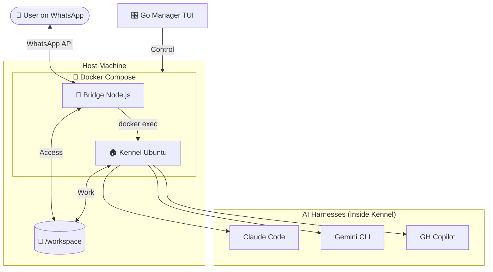
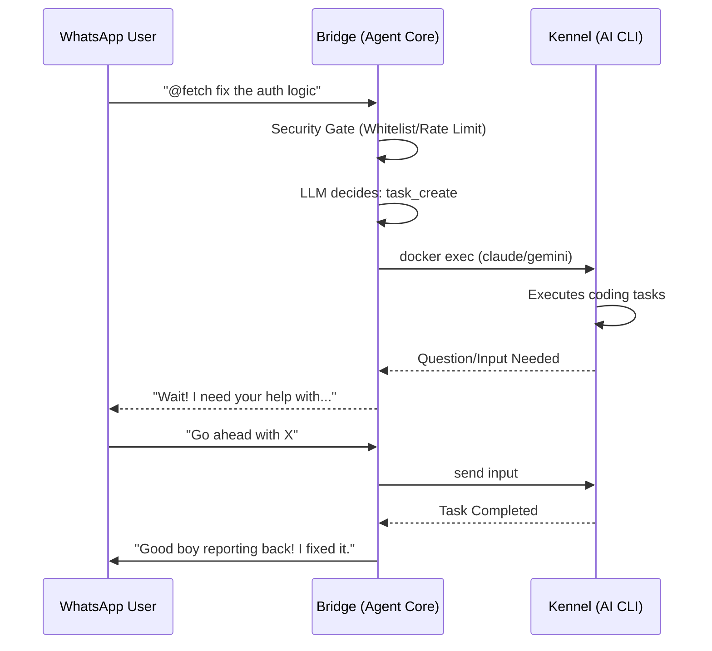
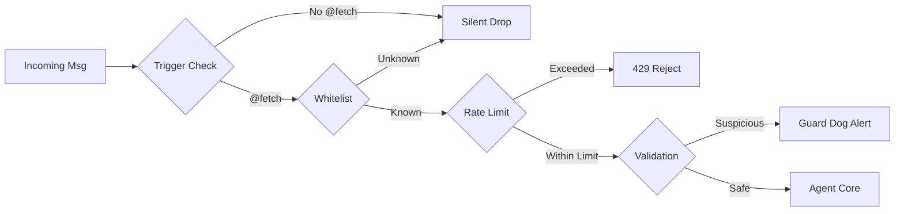

# 🐕 Fetch - Your Faithful Code Companion

**v4.0.3** · [Documentation](docs/markdown/DOCUMENTATION.md) · [Setup Guide](docs/markdown/SETUP_GUIDE.md) · [Changelog](CHANGELOG.md)

> ⚠️ **BETA PROJECT** — Experimental software. Review security implications before deployment.

Fetch: An autonomous coding environment that handles complex development tasks via natural language. Just message Fetch on WhatsApp to refactor code, fix bugs, or scaffold projects.



## 🎯 Overview

Fetch is a **lightweight orchestrator** that delegates coding tasks to specialized AI harnesses (Claude Code, Gemini CLI, GitHub Copilot CLI) while managing conversation state and user interaction via WhatsApp.

**Personality:** Fetch is a loyal coding companion - eager, helpful, and always ready to fetch code for you! He uses dog expressions like "Let me fetch that!" and "Good boy reporting back!" and *really* hates lobsters 🦞 (weird ocean bugs with anger issues) and cats 🐈 (sneaky creatures that don't respect personal space).

### 🏗️ LLM-First Architecture

Every message (except 5 safety escapes) takes the same single path through the LLM with all 13 tools:

| Layer | Trigger | Response | Latency |
| :--- | :--- | :--- | :--- |
| **Safety Gate** | `/stop`, `/undo`, `/clear`, `/help`, `/status` | Deterministic — no LLM | <5ms |
| **LLM + Tools** | Everything else | Chat, tool calls, or harness delegation | ~500ms–60s |



### AI Harnesses

| Harness | CLI | Strengths |
| :--- | :--- | :--- |
| **Claude Code** | `claude` | Multi-file refactoring, architecture, deep reasoning |
| **Gemini CLI** | `gemini` | Fast edits, explanations, boilerplate |
| **Copilot CLI** | `gh copilot` | Suggestions, command help |

---

## Quick Start

### Prerequisites

- Linux host (any architecture)
- Docker + Docker Compose
- Go 1.21+ (for Manager TUI)
- OpenRouter API key → [openrouter.ai](https://openrouter.ai)
- At least one AI CLI authenticated: `claude`, `gemini`, or `gh copilot`

### 1. Clone and Configure

```bash
git clone https://github.com/Traves-Theberge/Fetch.git
cd Fetch
cp .env.example .env
# Edit .env — set OWNER_PHONE_NUMBER and OPENROUTER_API_KEY at minimum
```

### 2. Build and Start

```bash
# Using the TUI Manager (recommended)
cd manager && go build -o fetch-manager . && ./fetch-manager

# Or directly with Docker Compose
docker compose up -d
docker logs -f fetch-bridge  # Scan the QR code
```

### 3. Message Fetch on WhatsApp

```text
@fetch what projects do I have?
@fetch switch to my-api
@fetch add input validation to the signup form
@fetch /status
```

---

## Commands

### Safety Escapes (Deterministic, no LLM)

| Command | Description |
| :--- | :--- |
| `/stop` | Cancel running task |
| `/undo` | Undo last commit (soft git reset) |
| `/clear` | Clear conversation history |
| `/help` | Show available commands |
| `/status` | System + task status |

Everything else is handled via natural language — project switching, settings, identity, skills, scheduling, and coding tasks all go through the LLM with 13 tools.

Full reference → [COMMANDS.md](docs/markdown/COMMANDS.md)

---

## 🔒 Security

Fetch employs a "Defense in Depth" strategy with 5 layers of protection:



- **@fetch trigger** — Messages must start with `@fetch` to be processed
- **Phone whitelist** — Only `OWNER_PHONE_NUMBER` + explicitly trusted numbers
- **Rate limiting** — Sliding window, 30 requests/minute per user
- **Input validation** — Shell injection patterns blocked, path traversal prevented
- **Docker isolation** — AI agents run in sandboxed containers
- **Authenticated API** — `/api/logout` requires bearer token
- **Read-only credentials** — Auth tokens mounted as read-only volumes

---

## 🛠️ Configuration

| Variable | Required | Default | Description |
| :--- | :--- | :--- | :--- |
| `OWNER_PHONE_NUMBER` | ✅ | — | Your WhatsApp number (e.g. `15551234567`) |
| `OPENROUTER_API_KEY` | ✅ | — | OpenRouter API key |
| `AGENT_MODEL` | — | `openai/gpt-4o-mini` | LLM for agent reasoning (via OpenRouter) |
| `SUMMARY_MODEL` | — | `openai/gpt-4o-mini` | LLM for conversation summaries |
| `VISION_MODEL` | — | `openai/gpt-4o-mini` | LLM for image analysis |
| `LOG_LEVEL` | — | `debug` | Minimum log level (`debug`/`info`/`warn`/`error`) |
| `ADMIN_TOKEN` | — | auto-generated | Bearer token for admin API |
| `TRUSTED_PHONE_NUMBERS` | — | — | Comma-separated trusted numbers |
| `FETCH_HISTORY_WINDOW` | — | `20` | Messages in LLM sliding window |
| `FETCH_COMPACTION_THRESHOLD` | — | `40` | Compact when messages exceed this |
| `FETCH_MAX_TOOL_CALLS` | — | `5` | Max tool call rounds per message |

Full reference → [CONFIGURATION.md](docs/markdown/CONFIGURATION.md)

---

## 📂 Project Structure

```text
Fetch/
├── manager/                    # Go TUI (Bubble Tea)
│   ├── main.go                 # Screen router, Bubble Tea model
│   └── internal/
│       ├── components/         # Header, menu, splash, spinner
│       ├── config/             # .env editor, whitelist manager
│       ├── docker/             # Container start/stop/logs
│       ├── models/             # OpenRouter model selector
│       ├── status/             # Bridge health client
│       └── theme/              # Lipgloss styles, borders, colors
├── fetch-app/                  # Node.js Bridge
│   └── src/
│       ├── index.ts            # Entry point, boot + shutdown
│       ├── config/env.ts       # Zod-validated env (Proxy pattern)
│       ├── config/pipeline.ts  # Context pipeline tuning (31 params)
│       ├── agent/              # Core LLM loop, formatting, prompts
│       ├── bridge/             # WhatsApp client + reconnection
│       ├── commands/           # Safety gate (5 escape commands)
│       ├── handler/            # Message entry, formatting
│       ├── harness/            # Base class + Claude/Gemini/Copilot
│       ├── identity/           # Hot-reloaded persona
│       ├── security/           # Gate, rate limiter, validator
│       ├── session/            # Session persistence (SQLite)
│       ├── skills/             # Skill framework
│       ├── task/               # Task lifecycle + SQLite
│       ├── tools/              # 13 orchestrator tools
│       ├── transcription/      # Voice → text (whisper.cpp)
│       ├── validation/         # Zod schemas, message validation
│       ├── vision/             # Image analysis
│       └── workspace/          # Project discovery, repo maps
│   └── tests/                  # 12 files, 173 tests
├── kennel/                     # AI CLI container (Ubuntu)
├── data/
│   ├── identity/               # COLLAR.md, ALPHA.md
│   ├── agents/                 # claude.md, gemini.md, copilot.md
│   └── skills/                 # Skill definition files
├── workspace/                  # Mounted code sandbox
├── docs/                       # Documentation site (D3 diagrams)
└── docker-compose.yml
```

---

## Development

```bash
cd fetch-app
npm install
npx tsc --noEmit          # Type check
npm run test:run           # 173 tests
npm run test:unit          # Unit tests only
npm run test:integration   # Integration tests only
npm run lint               # ESLint
```

## License

MIT

## Acknowledgments

- [whatsapp-web.js](https://github.com/pedroslopez/whatsapp-web.js) — WhatsApp Web API
- [Bubble Tea](https://github.com/charmbracelet/bubbletea) — TUI framework
- [OpenRouter](https://openrouter.ai) — AI model routing
- [whisper.cpp](https://github.com/ggerganov/whisper.cpp) — Voice transcription
