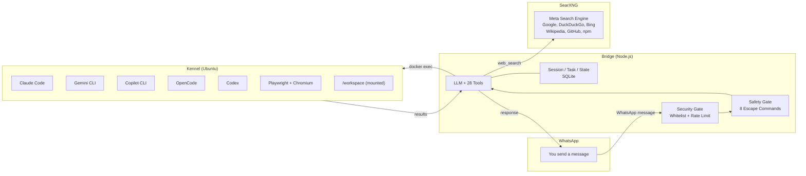

<div align="center">

```
  ⠀⠀⠀⠀⠀⠀⠀⢀⣠⣤⣠⣶⠚⠛⠿⠷⠶⣤⣀⡀⠀⠀⠀⠀⠀⠀⠀⠀⠀⠀
  ⠀⠀⠀⠀⠀⢀⣴⠟⠉⠀⠀⢠⡄⠀⠀⠀⠀⠀⠉⠙⠳⣄⠀⠀⠀⠀⠀⠀⠀⠀
  ⠀⠀⠀⢀⡴⠛⠁⠀⠀⠀⠀⠘⣷⣴⠏⠀⠀⣠⡄⠀⠀⢨⡇⠀⠀⠀⠀⠀⠀⠀    ███████╗███████╗████████╗ ██████╗██╗  ██╗
  ⠀⠀⠀⠺⣇⠀⠀⠀⠀⠀⠀⠀⠘⣿⠀⠀⠘⣻⣻⡆⠀⠀⠙⠦⣄⣀⠀⠀⠀⠀    ██╔════╝██╔════╝╚══██╔══╝██╔════╝██║  ██║
  ⠀⠀⠀⢰⡟⢷⡄⠀⠀⠀⠀⠀⠀⢸⡄⠀⠀⠀⠀⠀⠀⠀⠀⠀⠀⠉⢻⠶⢤⡀    █████╗  █████╗     ██║   ██║     ███████║
  ⠀⠀⠀⣾⣇⠀⠻⣄⠀⠀⠀⠀⠀⢸⡇⠀⠀⠀⠀⠀⠀⠀⠀⠀⠀⠀⠸⣀⣴⣿    ██╔══╝  ██╔══╝     ██║   ██║     ██╔══██║
  ⠀⠀⢸⡟⠻⣆⠀⠈⠳⢄⡀⠀⠀⡼⠃⠀⠀⠀⠀⠀⠀⠀⠀⠀⠶⠶⢤⣬⡿⠁    ██║     ███████╗   ██║   ╚██████╗██║  ██║
  ⠀⢀⣿⠃⠀⠹⣆⠀⠀⠀⠙⠓⠿⢧⡀⠀⢠⡴⣶⣶⣒⣋⣀⣀⣤⣶⣶⠟⠁⠀    ╚═╝     ╚══════╝   ╚═╝    ╚═════╝╚═╝  ╚═╝
  ⠀⣼⡏⠀⠀⠀⠙⠀⠀⠀⠀⠀⠀⠀⠙⠳⠶⠤⠵⣶⠒⠚⠻⠿⠋⠁⠀⠀⠀⠀
  ⢰⣿⡇⠀⠀⠀⠀⠀⠀⠀⣆⠀⠀⠀⠀⠀⠀⠀⢠⣿⠀⠀⠀⠀⠀⠀⠀⠀⠀⠀    Your Faithful Code Companion
  ⢿⡿⠁⠀⠀⠀⠀⠀⠀⠀⠘⣦⡀⠀⠀⠀⠀⠀⢸⣿⠀⠀⠀⠀⠀⠀⠀⠀⠀⠀   
  ⠀⠀⠀⠀⠀⠀⠀⠀⠀⠀⠀⠈⠻⣷⡄⠀⠀⠀⠀⣿⣧⠀⠀⠀⠀⠀⠀⠀⠀⠀
  ⠀⠀⠀⠀⠀⠀⠀⠀⠀⠀⠀⠀⠀⠈⢷⡀⠀⠀⠀⢸⣿⡄⠀⠀⠀⠀⠀⠀⠀⠀
  ⠀⠀⠀⠀⠀⠀⠀⠀⠀⠀⠀⠀⠀⠀⠀⠀⠀⠀⠀⠸⣿⠇⠀⠀⠀⠀⠀⠀⠀⠀

  v0.0.46
```

**Unleash Multi-agent orchestration.**

[](LICENSE)
[](https://nodejs.org)
[](https://typescriptlang.org)
[](https://golang.org)
[](https://docker.com)
[]()

</div>

---

Fetch is the Alpha of your AI workforce. Acting as the Pack Leader, it chats with you on WhatsApp to understand your goals, then commands a squad of specialized agents—Claude Code, Gemini, Copilot, and more—to execute complex coding tasks inside sandboxed Docker containers.

<br>

## How It Works



> **The flow:** Message arrives on WhatsApp &rarr; Security Gate checks sender &rarr; Safety Gate intercepts escape commands &rarr; LLM decides what to do with 29 tools available &rarr; For coding tasks, a CLI agent spawns in the Kennel via `docker exec` &rarr; Results sent back via WhatsApp.

<br>

## Architecture

Fetch runs as a **three-container system** managed by a native Go TUI:

| | Container | Tech | Role |
|:-:|-----------|------|------|
| **1** | **Bridge** | Node.js / TypeScript | WhatsApp client, agent core, 29 orchestrator tools, session & task persistence |
| **2** | **Kennel** | Ubuntu | Sandboxed env with Claude Code, Gemini CLI, Copilot CLI, OpenCode, Codex, Playwright + Chromium |
| **3** | **SearXNG** | Meta search engine | Self-hosted search aggregator (Google, DuckDuckGo, Bing, Wikipedia, GitHub, npm) |
| | **Manager** | Go / Bubble Tea | Host-side TUI for managing services, editing config, viewing logs |

<br>

## Features

<table>
<tr>
<td width="50%" valign="top">

### Core

- **LLM-First** &mdash; Every message hits the LLM with all 29 tools. No pre-classification, no regex routing
- **8 Safety Escapes** &mdash; `/stop` `/undo` `/clear` `/help` `/status` `/version` `/usage` `/trust` are deterministic and bypass the LLM
- **Live Context** &mdash; System prompt rebuilds after every state-changing tool call
- **Five Harnesses** &mdash; Claude Code, Gemini CLI, Copilot CLI, OpenCode, Codex with process lifecycle management
- **Structured Memory** &mdash; BM25-style keyword recall, chained compaction summaries, cross-session context
- **42 Tunable Parameters** &mdash; `FETCH_*` env vars control the entire pipeline, no code changes needed

</td>
<td width="50%" valign="top">

### Tools & Capabilities

- **28 Orchestrator Tools** &mdash; Workspace management, task lifecycle, GitHub ops, web fetch, web search, browser automation
- **Web Fetch & Search** &mdash; Readability + Turndown for pages, self-hosted SearXNG for search (no API keys)
- **Browser Automation** &mdash; Headless Chromium via Playwright with accessibility tree snapshots
- **Voice & Vision** &mdash; Voice notes transcribed via whisper.cpp, image analysis via vision model
- **GitHub Auto-Sync** &mdash; Commits, pushes, and auto-creates repos on workspace creation
- **Skills Framework** &mdash; Teach new capabilities by dropping Markdown into `data/skills/`

</td>
</tr>
</table>

<table>
<tr>
<td width="50%" valign="top">

### System

- **Dynamic Identity** &mdash; Hot-reloaded personality from Markdown files
- **Crash Recovery** &mdash; State persisted to SQLite, resumes after restart
- **10 Project Types** &mdash; Auto-detects Node, TypeScript, Python, Rust, Go, Java, Ruby, PHP, .NET with framework, package manager, and test runner profiling
- **Narrative Tool Outputs** &mdash; All tool results are human-readable text for better LLM reasoning, with structured metadata for state sync
- **Docker Hardening** &mdash; Healthchecks, resource limits, log rotation, shell injection prevention

</td>
<td width="50%" valign="top">

### The Pack (AI Harnesses)

| Harness | Best For |
|---------|----------|
| **Claude Code** | Deep refactoring, multi-file edits, architectural analysis |
| **Gemini CLI** | Quick fixes, explanations, boilerplate generation |
| **Copilot CLI** | Shell commands, git workflows |
| **OpenCode** | Versatile coding, OpenRouter-native, general-purpose |
| **Codex** | Agentic coding with OpenAI models, JSON Lines streaming |

</td>
</tr>
</table>

<br>

## Quick Start

```bash
# 1. Clone
git clone https://github.com/Traves-Theberge/Fetch.git
cd Fetch

# 2. Install (Auto-installs Docker, Go, Node.js, and Harnesses)
chmod +x install.sh
sudo ./install.sh

# 3. Configure
cp .env.example .env
nano .env

# 4. Launch Manager
cd manager
./fetch-manager
```

> **Note:** The `install.sh` script automates dependency checks and harness updates. For manual control, you can still use `./setup-dev.sh` and `./deploy.sh`.

<details>
<summary><strong>Required Environment Variables</strong></summary>

<br>

| Variable | Description |
|----------|-------------|
| `OPENROUTER_API_KEY` | API key from [OpenRouter](https://openrouter.ai) |
| `OWNER_PHONE_NUMBER` | Your WhatsApp number in E.164 format (e.g. `15551234567`) |

Add these to `.env` in the project root before running `deploy.sh`.

See [Configuration](docs/markdown/CONFIGURATION.md) for all 42 tunable parameters.

</details>

<br>

## Documentation

<table>
<tr>
<td>

| Guide | Description |
|:------|:------------|
| [Setup Guide](docs/markdown/SETUP_GUIDE.md) | Installation and first run |
| [TUI Guide](docs/markdown/TUI_GUIDE.md) | Manager terminal interface |
| [Commands](docs/markdown/COMMANDS.md) | Safety escapes and usage |
| [Configuration](docs/markdown/CONFIGURATION.md) | Env vars and config files |
| [Architecture](docs/markdown/ARCHITECTURE.md) | System design and data flow |
| [Harness System](docs/markdown/HARNESS_SYSTEM.md) | CLI adapter lifecycle |

</td>
<td>

| Guide | Description |
|:------|:------------|
| [Identity System](docs/markdown/IDENTITY_SYSTEM.md) | Dynamic persona and directives |
| [Skills Guide](docs/markdown/SKILLS_GUIDE.md) | Building skill plugins |
| [Context Pipeline](docs/markdown/CONTEXT_PIPELINE.md) | Memory, compaction, prompt assembly |
| [State Management](docs/markdown/STATE_MANAGEMENT.md) | SQLite persistence and shutdown |
| [API Reference](docs/markdown/API_REFERENCE.md) | Tool interfaces and endpoints |
| [Testing Guide](docs/markdown/TESTING_GUIDE.md) | Verification checklist |
| [Changelog](CHANGELOG.md) | Version history |

</td>
</tr>
</table>

<br>

## Development

<details>
<summary><strong>Bridge (TypeScript)</strong></summary>

```bash
cd fetch-app
npm install          # install dependencies
npm run dev          # run with ts-node (ESM)
npm run build        # compile TypeScript to dist/
npm run lint         # eslint
npm run test:run     # all tests (355 passing)
npm run test:unit    # unit tests only
```

</details>

<details>
<summary><strong>Manager (Go TUI)</strong></summary>

```bash
cd manager
go mod tidy                  # sync dependencies
go build -o fetch-manager .  # build binary
./fetch-manager              # launch TUI
bash build.sh                # cross-compile (x86_64 + arm64)
```

</details>

<details>
<summary><strong>Docker</strong></summary>

```bash
./deploy.sh                    # build images + start containers
docker compose build           # build only
docker compose up -d           # start containers
docker compose down            # stop containers
docker logs -f fetch-bridge    # stream bridge logs (QR code appears here)
```

</details>

<br>

---

<div align="center">

**MIT License** &bull; Built by [Traves Theberge](https://github.com/Traves-Theberge)

</div>
