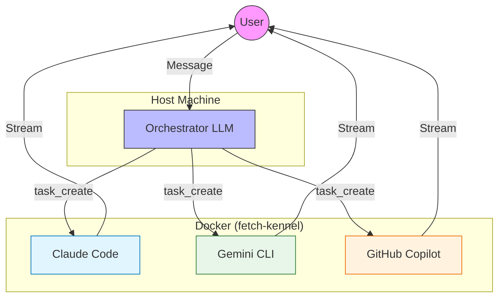

# Agentic Architecture

> Fetch uses an **LLM-first architecture** where every message takes the same single path through the LLM with full tool access. The LLM decides what to do — chat, call tools, or delegate to a harness — based on the message content and conversation context.



## The Pack (Harnesses)

When the Orchestrator (core agent) determines a task is too complex for simple file edits or requires running code, it delegates to a specialized AI CLI running inside the **Kennel** sandbox. We call this collection of specialized agents **"The Pack"**.

### Delegation Flow

1. **Orchestrator** calls `task_create(goal, harness)`
2. **Spawner** wraps the CLI command with `docker exec`
3. **Harness** runs inside the `fetch-kennel` container
4. **Output** is streamed back to the user

### Specialized Agents

| Agent | CLI | Best For |
|-------|-----|----------|
| **Claude Code** | `claude` | Deep architectural refactoring, multi-file changes, and complex reasoning. |
| **Gemini** | `gemini` | Fast explanations, quick fixes, and single-file edits. |
| **Copilot** | `gh copilot` | Shell commands, git workflows, and explanations. |

## Single Path Architecture

Previously, Fetch used complex regex routing (Intent Classifier, Mode Detector). In the current architecture, this was entirely replaced by the LLM's own reasoning capabilities.

```
Message → Security Gate → Safety Gate (5 commands)
                              ↓
                         LLM with ALL 21 tools
                              ↓
                         ReAct loop (reason → act → observe)
                              ↓
                         Response or task delegation
```

### Safety Gate

These 5 commands bypass the LLM entirely for reliability:

* `/stop` - Kill running task
* `/undo` - Revert last commit
* `/clear` - Wipe context
* `/help` - Show commands
* `/status` - System health

## Autonomy & Tool Use

The Orchestrator has access to **21 tools** categorized into:

* **Workspace**: `workspace_list`, `workspace_select`, `workspace_create`...
* **Tasks**: `task_create`, `task_status`, `task_cancel`...
* **Interaction**: `ask_user`, `report_progress`
* **GitHub**: `gh_repo_create`, `gh_pr_create`, `gh_issue_create`...

### Autonomy Rules

The system prompt enforces 7 strict autonomy rules:

1. **Execute immediately** — Never ask for permission; just do it.
2. **Infer details** — Make reasonable assumptions for missing args.
3. **Chain tools** — Perform multiple steps in one turn.
4. **Report results** — Confirm *after* doing, not before.

This ensures Fetch acts as an **agent**, not a chatbot.
