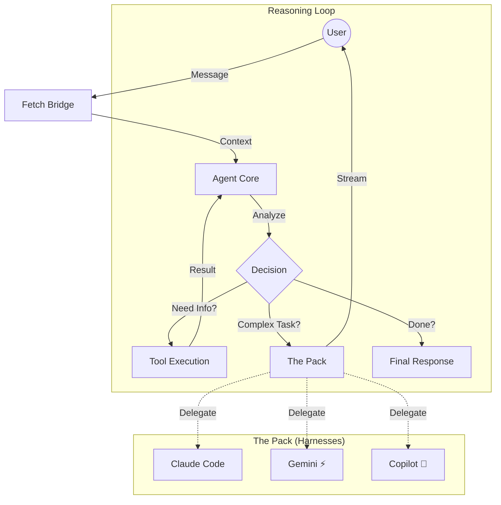

# Agentic Workflow

> Fetch operates as an **Autonomous Agent**, not a chatbot. It perceives the environment, reasons about the best course of action, and executes tools to achieve high-level goals.

## The Agent Loop (ReAct)

Fetch uses a modified **ReAct (Reason + Act)** loop to solve complex tasks.

## Core Components

### 1. The Orchestrator

The main LLM (currently defaults to **GPT-4o Mini**) acts as the brain. It:

* Maintains the conservation history.
* Decides which tool to call.
* Determines when to delegate to a specialized harness.

### 2. The Context Pipeline

Before the LLM sees a message, Fetch builds a rich context window including:

* **Project Capabilities:** Detected traits (e.g., "React App", "Dockerized").
* **Active Workspace:** File structure and git status.
* **Conversation History:** Compaction-optimized message log.

### 3. "The Pack" (Delegation)

For tasks requiring heavy lifting or specific domain knowledge, the Orchestrator delegates to specialized sub-agents running in the `fetch-kennel` sandbox.

* **Claude Code:** Architecture, refactoring, complex logic.
* **Gemini CLI:** Fast iterations, explanations, diverse coding tasks.
* **GitHub Copilot:** Shell commands, git operations, quick questions.

## Autonomy Rules

To ensure Fetch behaves like an agent, it adheres to these **Prime Directives**:

1. **Execute Immediately:** Do not ask for permission for reversible actions.
2. **Infer Context:** Make reasonable assumptions instead of asking clarifying questions for every detail.
3. **Chain Actions:** Perform multiple steps (e.g., Create File -> Write Content -> Run Test) in a single turn.
4. **Fail & Recover:** If a tool fails, analyze the error and try a fix *before* reporting back to the user.
