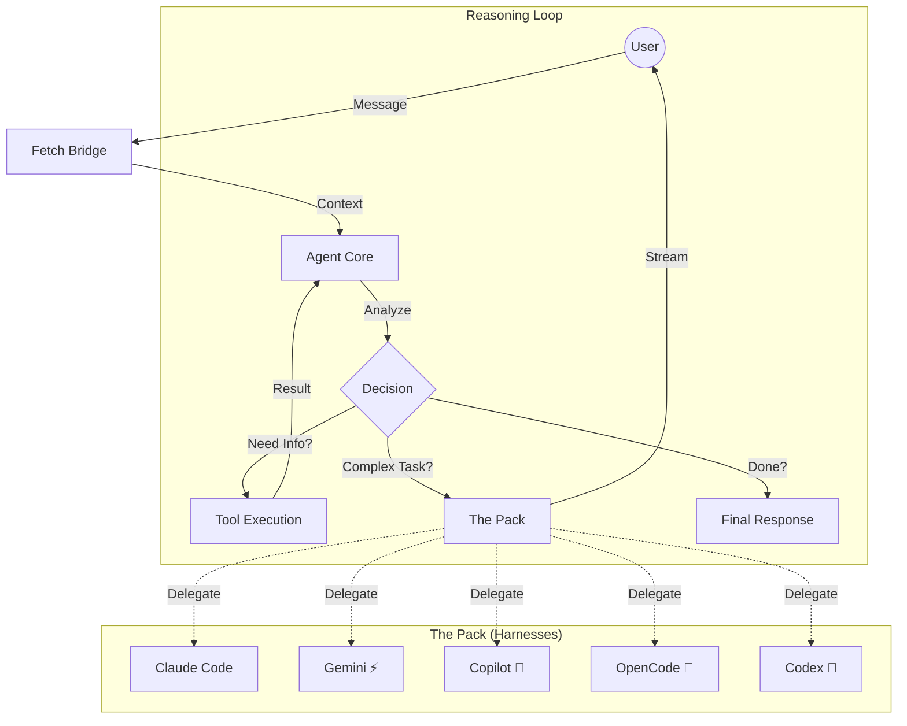

# Agentic Workflow

> Fetch operates as an **Autonomous Agent**, not a chatbot. It perceives the environment, reasons about the best course of action, and executes tools to achieve high-level goals.

## The Agent Loop (ReAct)

Fetch uses a modified **ReAct (Reason + Act)** loop to solve complex tasks.

## Core Components

### 1. The Orchestrator

The main LLM (currently defaults to **GPT-4o Mini**) acts as the brain. It:

* Maintains the conservation history.
* Decides which tool to call.
* Determines when to delegate to a specialized harness.

### 2. The Context Pipeline

Before the LLM sees a message, Fetch builds a rich context window including:

* **Project Capabilities:** Detected traits (e.g., "React App", "Dockerized").
* **Active Workspace:** File structure and git status.
* **Conversation History:** Compaction-optimized message log.

### 3. "The Pack" (Delegation)

For tasks requiring heavy lifting or specific domain knowledge, the Orchestrator delegates to specialized sub-agents running in the `fetch-kennel` sandbox.

* **Claude Code:** Architecture, refactoring, complex logic.
* **Gemini CLI:** Fast iterations, explanations, diverse coding tasks.
* **GitHub Copilot:** Shell commands, git operations, quick questions.
* **OpenCode:** Versatile coding, OpenRouter-native, general-purpose.
* **Codex:** Agentic coding with OpenAI models, JSON Lines streaming.

## Autonomy Rules

To ensure Fetch behaves like an agent, it adheres to these **9 Prime Directives** (injected at highest priority in the system prompt):

1. **Execute Immediately:** If the user tells you to do something, do it — don't ask for permission for reversible actions.
2. **Use Active Workspace:** If a workspace is selected, use it — don't ask which project.
3. **Infer Context:** If intent is clear, act immediately — make reasonable assumptions.
4. **Minimal ask_user:** Use `ask_user` only when genuinely missing critical information.
5. **Action Over Questions:** Prefer doing and reporting over asking and waiting.
6. **No Parroting:** Never repeat the user's request back as a question.
7. **Express Intent:** Briefly and naturally express your plan/intent before acting.
8. **Clarify Agent Selection:** When multiple harnesses are enabled and the request is ambiguous, call `ask_user` to clarify which agent to use.
9. **Short Messages Are Valid:** Treat short messages as valid requests — don't ask for elaboration.
