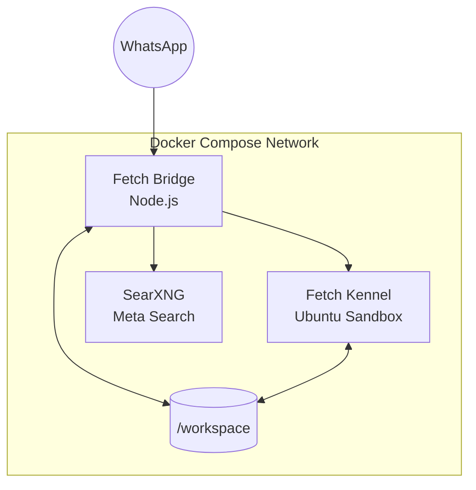
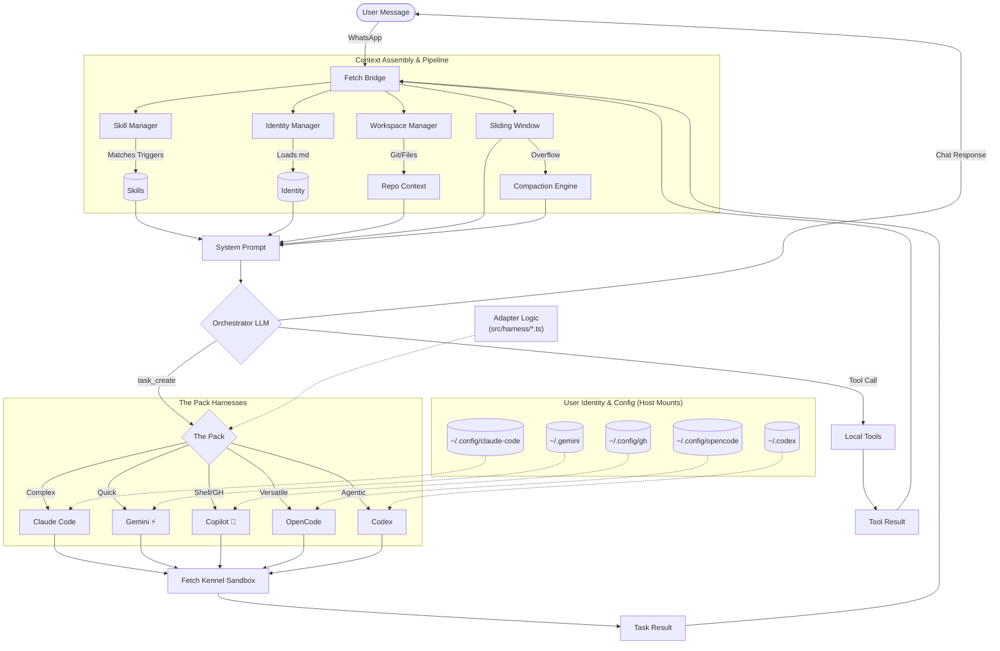
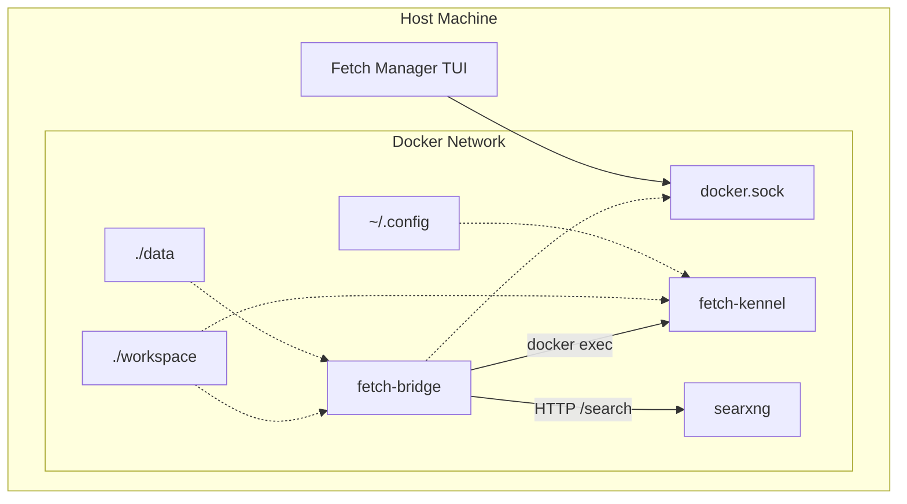

# Architecture

## System Overview



Fetch runs as three Docker containers managed by a Go TUI:

- **Bridge** (Node.js) — Connects to WhatsApp, runs the agent core, manages sessions and tasks
- **Kennel** (Ubuntu) — Sandboxed container where AI CLIs (Claude Code, Gemini, Copilot, OpenCode, Codex) and Playwright+Chromium execute against the workspace
- **SearXNG** — Self-hosted meta search engine providing the `web_search` backend (aggregates Google, DuckDuckGo, Bing, Wikipedia, GitHub, StackOverflow, npm)
- **Manager** (Go, runs on host) — TUI for starting/stopping Docker, editing config, viewing logs

The Bridge communicates with the Kennel by running `docker exec` commands into it. The workspace directory is mounted into both containers. The Bridge container has the Docker CLI installed and the Docker socket mounted so it can control the Kennel directly.

## Message Flow (LLM-First)

### System Diagram



1. WhatsApp message arrives via whatsapp-web.js
2. **SecurityGate** checks `@fetch` trigger, phone whitelist, rate limit, input validation
3. **Safety Gate** checks for 8 deterministic escape commands (`/stop`, `/undo`, `/clear`, `/help`, `/status`, `/version`, `/usage`, `/trust`) — if matched, responds immediately without LLM
4. **Everything else** goes to the LLM with **all 27 tools** available
5. **Agent core** builds message history in OpenAI multi-turn format (with `tool_calls` + `tool_call_id`) and runs the LLM
6. The LLM enters a ReAct loop — it decides whether to chat, call tools, or delegate to a harness
7. **System prompt rebuilds** after state-changing tools (`workspace_select`, `workspace_create`, `task_create`) so the LLM always sees current context
8. `task_create` tool spawns a CLI process in the Kennel container via `docker exec`
9. Response is formatted and sent back via WhatsApp

## Boot Sequence

The Bridge starts with this ordered initialization:

1. `validateEnv()` — Zod schema validates all environment variables (fail-fast)
2. Start HTTP status API on port 8765
3. **Async identity loading** — `IdentityLoader.load()` reads identity files using `fs.promises` for non-blocking I/O
4. **Skill initialization** — `SkillManager.init()` loads built-in skills from `src/skills/builtin/` and user skills from `data/skills/`
5. Create WhatsApp Bridge client
6. WhatsApp authenticates (QR code or cached session)
7. Bridge `ready` event fires — system is operational

## Shutdown Sequence

On SIGINT/SIGTERM or unhandled exception:

1. Kill all harness processes (`spawner.killAll()`)
2. **Shutdown managers** — `SkillManager.shutdown()`, `IdentityManager.shutdown()` close file watchers
3. Destroy WhatsApp bridge connection
4. Close SQLite databases (flush WAL)
5. `process.exit()`

Global `uncaughtException` handler triggers this same shutdown path. `unhandledRejection` is logged but does not trigger shutdown.

### EventEmitter Subclasses

Several managers extend `EventEmitter` and implement `shutdown()` methods to clean up resources:
- **SkillManager** — Closes chokidar file watcher, removes event listeners
- **IdentityManager** — Closes chokidar file watcher, removes event listeners

These shutdown methods prevent memory leaks and ensure graceful cleanup when the Bridge terminates.

## Dependencies (Runtime)

| Package | Purpose | Used By |
| --- | --- | --- |
| `openai` | OpenAI-compatible SDK — pointed at **OpenRouter** (`baseURL: openrouter.ai/api/v1`) | `agent/core.ts` (ReAct loop), `vision/index.ts` (image analysis), `session/manager.ts` (compaction) |
| `whatsapp-web.js` | WhatsApp Web client via Puppeteer | `bridge/client.ts` |
| `better-sqlite3` | SQLite with WAL mode for sessions & tasks | `session/store.ts`, `task/store.ts` |
| `zod` | Schema validation (env, tool inputs, IDs) | `config/env.ts`, `validation/`, `tools/loader.ts` |
| `dockerode` | Docker API for container management | `utils/docker.ts` |
| `gray-matter` | YAML frontmatter parsing for skills | `skills/loader.ts` |
| `chokidar` | File watcher for identity/skills hot-reload with error handlers | `identity/manager.ts`, `skills/manager.ts` |
| `nanoid` | Collision-resistant ID generation | `utils/id.ts` |
| `strip-ansi` | Strip ANSI codes from harness CLI output | `harness/output-parser.ts` |
| `dotenv` | Load `.env` file | `config/env.ts` |
| `jsdom` | DOM implementation for Node.js | `tools/web.ts` (HTML parsing for web_fetch) |
| `@mozilla/readability` | Content extraction (Mozilla Readability) | `tools/web.ts` (main content extraction) |
| `turndown` | HTML to Markdown converter | `tools/web.ts` (markdown output) |

> **Note:** The `openai` npm package is **not** used to call OpenAI directly. It serves as an OpenAI-compatible client for **OpenRouter**, which routes to any model (GPT-4o, Claude, Gemini, etc.). Claude Code, Gemini CLI, and GitHub Copilot CLI are invoked as **CLI processes** in the Kennel container via `docker exec` — they do not use SDK packages in the Bridge.

## Module Map

```text
src/
├── index.ts              # Boot + shutdown orchestration
├── config/
│   ├── env.ts            # Zod-validated env with Proxy (lazy reads)
│   ├── pipeline.ts       # Context pipeline tuning (42 params, FETCH_* env overrides)
│   └── paths.ts          # Centralized path constants
├── api/
│   └── status.ts         # HTTP status API (port 8765), docs server, health check
├── bridge/
│   └── client.ts         # WhatsApp client, QR auth, reconnection (exponential backoff)
├── security/
│   ├── index.ts          # Barrel exports
│   ├── gate.ts           # @fetch trigger + phone authorization
│   ├── rateLimiter.ts    # Sliding window rate limiter with periodic eviction, circuit breaker thread-safety
│   ├── validator.ts      # Input sanitization (injection, traversal)
│   └── whitelist.ts      # Trusted phone number management with persistence mutex
├── handler/
│   └── index.ts          # Message entry point, session lifecycle, safety-gate dispatch, response building
├── agent/
│   ├── core.ts           # Single-path LLM handler, ReAct loop, all 27 tools
│   ├── notifications.ts  # Hybrid LLM/template notification formatter
│   ├── format.ts         # Response formatting
│   ├── prompts.ts        # System prompt builders (profile-aware workspace context)
│   └── whatsapp-format.ts # WhatsApp-specific formatting
├── commands/
│   ├── index.ts          # Barrel exports
│   ├── parser.ts         # Safety gate — 8 deterministic escape commands
│   ├── task.ts           # /stop, /undo handlers (kill task, git reset)
│   ├── trust.ts          # /trust handler — owner-only whitelist management
│   └── types.ts          # Command result types
├── harness/
│   ├── base.ts           # AbstractHarnessAdapter (shared logic)
│   ├── claude.ts         # Claude Code adapter (container: 'fetch-kennel')
│   ├── gemini.ts         # Gemini CLI adapter (container: 'fetch-kennel')
│   ├── copilot.ts        # Copilot CLI adapter (container: 'fetch-kennel')
│   ├── opencode.ts       # OpenCode adapter (container: 'fetch-kennel')
│   ├── codex.ts          # Codex adapter (container: 'fetch-kennel')
│   ├── registry.ts       # Adapter registry (single source)
│   ├── executor.ts       # Task execution via pool
│   ├── spawner.ts        # Process spawn with docker exec wrapping, timer-map guard pattern
│   ├── pool.ts           # Concurrency management (max 1, aligned with TaskManager)
│   ├── output-parser.ts  # Harness output parsing
│   └── types.ts          # HarnessConfig, ErrorCategory, HarnessResult
├── identity/
│   ├── manager.ts        # System prompt builder, hot-reload watcher
│   ├── loader.ts         # Parse COLLAR.md, ALPHA.md
│   ├── types.ts          # AgentIdentity interface
│   └── docs/             # See [IDENTITY_SYSTEM.md](./IDENTITY_SYSTEM.md) for details
├── skills/
│   ├── index.ts          # Barrel re-exports
│   ├── loader.ts         # Parse SKILL.md frontmatter (gray-matter)
│   ├── manager.ts        # Skill discovery, activation, management
│   ├── types.ts          # Skill, SkillConfig, SkillRequirements
│   └── builtin/          # 7 built-in skills (git, docker, testing, etc.)
├── session/
│   ├── manager.ts        # Session CRUD, messages, compaction with failure tracking, repo-map cache
│   ├── store.ts          # SQLite persistence (sessions.db, WAL mode), promise-lock singleton
│   └── types.ts          # Session, Message, Preferences interfaces
├── task/
│   ├── index.ts           # Barrel exports
│   ├── manager.ts        # Task lifecycle, single source of truth
│   ├── store.ts          # SQLite persistence (tasks.db)
│   ├── integration.ts    # TaskIntegration — bridges harness events to task state
│   └── types.ts          # Task, TaskStatus, TaskConstraints interfaces
├── tools/
│   ├── index.ts          # Barrel exports for tools module
│   ├── registry.ts       # Tool registry (27 tools) with custom tool hot-reload
│   ├── types.ts          # ToolContext, ToolResult, DangerLevel interfaces
│   ├── loader.ts         # Custom tool loader (data/tools/*.json → shell handlers)
│   ├── workspace.ts      # Workspace tools (list, select, status, create, delete, sync, publish)
│   ├── task.ts           # Task tools (create, status, cancel, respond)
│   ├── interaction.ts    # Interaction tools (ask_user with autonomy guard, report_progress)
│   ├── web.ts            # Web tools (web_fetch via Readability+Turndown, web_search via SearXNG)
│   └── browser.ts        # Browser tools (open, snapshot, action, screenshot via Playwright in Kennel)
├── validation/
│   ├── common.ts         # Reusable Zod schemas (IDs, paths, timestamps, strings)
│   └── tools.ts          # Zod schemas for all 27 tool inputs
├── transcription/
│   └── index.ts          # whisper.cpp voice transcription
├── vision/
│   └── index.ts          # Image analysis via OpenRouter
├── workspace/
│   ├── manager.ts        # Project discovery, GitHub sync, workspace lifecycle
│   ├── profiler.ts       # Rich project detection (framework, pkg manager, test runner, entry points)
│   ├── repo-map.ts       # Repository structure mapping (dynamic extensions per project type)
│   ├── symbols.ts        # Symbol extraction (10 languages: TS, Python, Go, Rust, Java, Ruby, PHP, .NET)
│   └── types.ts          # Workspace, GitStatus, ProjectProfile, WorkspaceEvent types
└── utils/
    ├── logger.ts         # Colored logger with LOG_LEVEL filtering
    ├── id.ts             # ID generators (tsk_, prg_ prefixes via nanoid)
    └── docker.ts         # Docker exec helpers
```

## Context Pipeline

### Memory Pipeline Diagram

[See Context Pipeline Documentation](./CONTEXT_PIPELINE.md)

The context pipeline ensures the LLM has full conversational memory across turns:

1. **Message Persistence** — All messages (user, assistant, tool calls, tool results) are persisted through `SessionManager` methods, not bare array pushes
2. **OpenAI Multi-Turn Format** — `buildMessageHistory()` emits proper format: `assistant` messages carry `tool_calls`, `tool` messages carry results with matching `tool_call_id`
3. **Sliding Window** — Last `pipeline.historyWindow` (default 20) messages are sent to the LLM
4. **Compaction** — When total messages exceed `pipeline.compactionThreshold` (default 40), older messages are LLM-summarized into `session.metadata.compactionSummary` and the array is trimmed
5. **Task Completion Hooks** — `task:completed` / `task:failed` events write to session history and push WhatsApp notifications
6. **Session-Aware Tools** — `ToolContext { sessionId, autonomyLevel }` flows through the registry to tool handlers
7. **Dynamic Prompt Rebuild** — System prompt at `messages[0]` is replaced after `workspace_select`, `workspace_create`, or `task_create` so the LLM always sees current state
8. **Task Goal Framing** — `frameTaskGoal()` expands raw user text into self-contained goals before harness dispatch

All parameters are tunable via `config/pipeline.ts` (42 settings, overridable via `FETCH_*` env vars).

## Docker Architecture



### SearXNG Container

The SearXNG container provides a JSON API at `http://searxng:8080/search` on the Docker network. The Bridge queries it from `tools/web.ts` when `web_search` is called. Configuration lives in `config/searxng/settings.yml` and enables multiple search engines (Google, DuckDuckGo, Bing, Wikipedia, GitHub, StackOverflow, npm).

### Container Communication

The Bridge container has the Docker socket mounted read-only **and the Docker CLI installed**. It controls the Kennel using `docker exec`:

```bash
docker exec -w /workspace/my-project -e GOAL="..." fetch-kennel claude --print --dangerously-skip-permissions -p "..."
```

The harness spawner automatically wraps commands with `docker exec` when the adapter config includes `container: 'fetch-kennel'`. This is the core of the dual-container architecture: Bridge (brain) controls Kennel (muscle).

### Kennel Entrypoint

**Kennel Entrypoint:** The Kennel container has a custom entrypoint (`kennel/entrypoint.sh`) that enables `workspace_sync` and `workspace_create` to push to GitHub.

### Volume Mounts

| Volume | Bridge | Kennel | Mode |
| --- | --- | --- | --- |
| `./workspace` | ✅ | ✅ | read-write |
| `./data` | ✅ | — | read-write |
| `docker.sock` | ✅ | — | read-only |
| `~/.config/gh` | — | ✅ | read-only |
| `~/.config/claude-code` | — | ✅ | read-only |
| `~/.claude` | — | ✅ | read-only |
| `~/.gemini` | — | ✅ | read-write |
| `~/.config/opencode` | — | ✅ | read-only |
| `~/.codex` | — | ✅ | read-only |

## Database Schema

### sessions.db

| Table | Purpose | Key Fields |
| --- | --- | --- |
| `sessions` | Session blobs | `id`, `user_id`, `data` (JSON), `created_at`, `updated_at` |
| `memory` | Structured memory entries | `id`, `session_id`, `category`, `content`, `keywords`, `importance`, `recall_count` |
| `meta` | Key-value metadata | `key`, `value` |

### tasks.db

| Table | Purpose | Key Fields |
| --- | --- | --- |
| `tasks` | Task records | `id`, `session_id`, `goal`, `status`, `harness`, `result`, `iterations` |

Both databases use WAL (Write-Ahead Logging) mode for concurrent read/write access without locking.

## Concurrency & Thread Safety

Fetch uses several patterns to ensure thread-safe operations in its asynchronous runtime:

### Promise-Lock Singleton Pattern

The `SessionStore` and `TaskStore` use a **promise-lock singleton** initialized at module load:

```typescript
const sessionLock = new PromiseLock();
```

This prevents race conditions during concurrent database operations. All critical sections (writes, compactions) acquire the lock before proceeding.

### Timer-Map Guard Pattern

The `ProcessSpawner` uses a timer-map guard to prevent memory leaks from orphaned timeout timers:

```typescript
if (this.timeoutTimers.has(taskId)) {
  clearTimeout(this.timeoutTimers.get(taskId));
  this.timeoutTimers.delete(taskId);
}
```

This pattern ensures cleanup even when processes terminate early or fail.

### Persistence Mutex

The `Whitelist` class uses a mutex to serialize file writes:

```typescript
private persistMutex = new PromiseLock();
```

This prevents corrupted state when multiple whitelist operations happen concurrently.

### Circuit Breaker Thread-Safety

The `RateLimiter` circuit breaker is documented as thread-safe for concurrent access across multiple WhatsApp message handlers.

## Error Recovery

| Failure | Recovery |
| --- | --- |
| Bridge crash | Mode and task state persisted to SQLite; tasks resume on restart |
| WhatsApp disconnect | Exponential backoff reconnection (5s base, 5min cap, 10 max retries) |
| Harness timeout | Task marked as failed, user notified |
| Unhandled rejection | Global handler triggers graceful shutdown |
| LLM API failure | Retry with backoff, then fail task with error message |
| Compaction failure | Tracked with escalating behavior (log warning → log error → disable) |
| Watcher error | Logged but non-fatal, hot-reload continues on subsequent changes |
