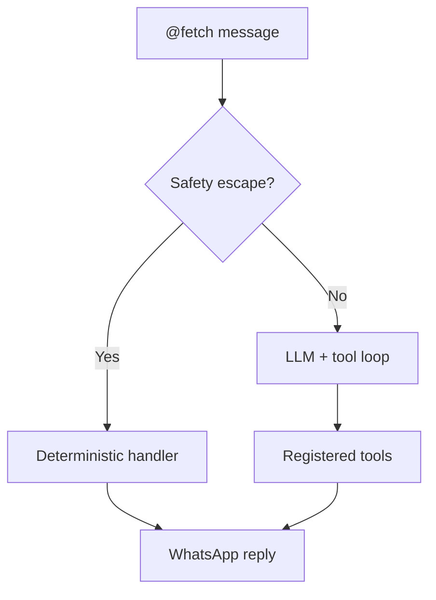

# Command Reference

## Implementation References

- Command parsing/dispatch: `fetch-app/src/commands/parser.ts`, `fetch-app/src/commands/index.ts`, `fetch-app/src/commands/task.ts`, `fetch-app/src/commands/trust.ts`.
- Tool catalog source: `fetch-app/src/tools/registry.ts`, `fetch-app/src/validation/tools.ts`.
- Validation tests: `fetch-app/tests/unit/command-parser.test.ts`, `fetch-app/tests/unit/tool-validation-contracts.test.ts`.


## Trigger

All messages must start with `@fetch` to be processed:

```
@fetch /status
@fetch fix the login bug
@fetch hello
```

In direct (1:1) chats with Fetch, the `@fetch` prefix is optional.

## Architecture: LLM-First with Safety Escapes

Fetch uses an **LLM-first** architecture. There are no slash commands for project management, settings, identity, or skills — the LLM handles all of those through natural language and its registered orchestrator tools.

The only slash commands that exist are **8 safety escapes** — deterministic commands that bypass the LLM entirely. These exist because they need to work even when the LLM is unreachable or stuck.



## Safety Escape Commands

These are handled deterministically without an LLM call (<5ms):

| Command | Aliases | Description |
|---------|---------|-------------|
| `/stop` | `stop`, `/cancel` | Cancel the running task immediately and terminate active harness execution |
| `/undo` | — | Show manual git commands to revert last commit. `/undo all` reverts to task start |
| `/clear` | `clear`, `/reset` | Clear conversation history |
| `/help` | `help`, `/h`, `/?` | Show available commands |
| `/status` | `status`, `/st` | System and task status |
| `/version` | `/v` | Show Fetch version information |
| `/usage` | `/u` | Show OpenRouter API usage and spend |
| `/trust` | — | Manage trusted phone numbers (owner only): `add`, `remove`, `list` |

Everything else — including project switching, git operations, settings, identity management, skills, scheduling, and coding tasks — is handled by sending natural language to the LLM.

Note: natural-language capability prompts like "what can you do?" now use the LLM conversational path (context-aware and personalized). Use `/help` when you want the deterministic full command/tool catalog.

## Natural Language (Everything Else)

The LLM has access to registered orchestrator tools and decides which to call based on your message. Here are examples:

### Tooling Layers (How To Think About It)

| Layer | Purpose | Primary Tools |
|---------|----------------|-------------|
| Delegation | Open-ended implementation that needs reasoning/iteration | `task_create`, `task_status`, `task_cancel`, `task_respond` |
| Interactive | Explore or inspect external systems/web UIs in real time | `web_search`, `web_fetch`, `browser_open`, `browser_snapshot`, `browser_action`, `browser_screenshot` |
| Execution | Deterministic steps with clear pass/fail output | `app_run`, `app_test`, `browser_test` |

Rule of thumb:
- If the ask is "do the whole coding job", use Delegation.
- If the ask is "inspect/click/read/search", use Interactive.
- If the ask is "run this exact step/check", use Execution.

### Workspace Management

| Message | What Fetch Does |
|---------|----------------|
| "What projects do I have?" | Calls `workspace_list` — shows all workspace projects |
| "Switch to my-api" | Calls `workspace_select` — changes active project |
| "How's the project looking?" | Calls `workspace_status` — shows git status, recent commits |
| "Create a new project called auth-service" | Calls `workspace_create` — scaffolds project, creates GitHub repo |
| "Delete the test-api project" | Calls `workspace_delete` — removes project (with confirmation) |
| "Sync my changes to GitHub" | Calls `workspace_sync` — commits and pushes to remote |

### GitHub Operations

| Message | What Fetch Does |
|---------|----------------|
| "Create a draft PR" | Calls `github_pr_create` — opens a new Pull Request |
| "List open PRs on facebook/react" | Calls `github_pr_list` — shows repository PRs |
| "Show 5 PRs" | Calls `github_pr_list` — shows PRs with limit |
| "View PR #42 on other/repo" | Calls `github_pr_view` — shows details for specific repo |
| "Create an issue: fix login bug" | Calls `github_issue_create` — opens a new issue |
| "Show my issues" | Calls `github_issue_list` — lists active issues |
| "Create branch feat/auth" | Calls `github_branch_create` — creates branch locally/remotely |
| "Search for 'whatsapp bot' on GitHub" | Calls `github_search_repos` — finds relevant repositories |
| "Check workflow status" | Calls `github_action_status` — shows status of recent CI runs |

### Task Delegation

| Message | What Fetch Does |
|---------|----------------|
| "Build a REST API for users" | Calls `task_create` — delegates to Claude Code in the Kennel |
| "Fix the auth bug in login.ts" | Calls `task_create` — targeted coding task |
| "How's the task going?" | Calls `task_status` — shows progress and output |
| "Cancel the current task" | Calls `task_cancel` — terminates the running harness |
| "Actually, add JWT support too" | Calls `task_respond` — sends follow-up to the running harness |

### Interaction

| Message | What Fetch Does |
|---------|----------------|
| "Hey Fetch!" | LLM responds directly — no tools needed |
| "What can you do?" | LLM gives a conversational capability overview + suggested next action |
| "Explain how the rate limiter works" | LLM reads context and explains — may call workspace tools |
| "What's the status of everything?" | Calls `report_progress` — comprehensive system summary |

### Web & Browser

| Message | What Fetch Does |
|---------|----------------|
| "Fetch the docs at <https://example.com/api>" | Calls `web_fetch` — extracts readable content as markdown |
| "Search for 'typescript zod validation'" | Calls `web_search` — searches the web via SearXNG |
| "Open <https://example.com> in the browser" | Calls `browser_open` — navigates and returns accessibility tree |
| "Click the login button" | Calls `browser_action` — performs click on referenced element |
| "Take a screenshot of the page" | Calls `browser_screenshot` — captures current browser state |

### Workflows, Cron, and Runtime Checks

| Message | What Fetch Does |
|---------|----------------|
| "Create workflow nightly-check: status, npm test, sync" | Calls `workflow_create` — saves reusable multi-step flow |
| "Run workflow nightly-check now" | Calls `workflow_run` — executes all workflow steps in order |
| "Schedule nightly-check at 0 3 * * *" | Calls `cron_create` — creates UTC cron schedule |
| "Show my cron jobs" | Calls `cron_list` — lists scheduled workflow triggers |
| "Run cron nightly-check now" | Calls `cron_run` — triggers the cron workflow immediately |
| "Run npm run build in my app" | Calls `app_run` — deterministic command execution in workspace |
| "Run tests for this project" | Calls `app_test` — deterministic test execution (auto-detect supported) |
| "Browser test example.com for Login text" | Calls `browser_test` — deterministic snapshot-based assertion |

Workflow safety guardrails:

- Workflow steps must reference valid existing tools.
- Recursive orchestration tools (`workflow_*`, `cron_*`) are blocked inside workflow steps.
- Task-interaction tools (`ask_user`, `report_progress`) are blocked inside workflow steps.
- Prefer execution-layer tools in workflows; avoid open-ended delegation in workflow steps.

### Identity & Skills

| Message | What Fetch Does |
|---------|----------------|
| "What skills do you have?" | LLM reads skill list from context and responds |
| "Use the python skill" | LLM activates the skill for the session |
| "Reset your identity" | LLM reloads identity files from disk |
| "Who are you?" | LLM responds from its identity context |

## Orchestrator Tools Reference

The LLM has access to the registered tools:

| Tool | Category | Description |
|------|----------|-------------|
| `workspace_list` | Workspace | List all projects in /workspace |
| `workspace_select` | Workspace | Switch active project (triggers prompt rebuild) |
| `workspace_status` | Workspace | Git status, branch, recent commits |
| `workspace_create` | Workspace | Create new project + GitHub repo |
| `workspace_delete` | Workspace | Delete a workspace project |
| `folder_delete` | Workspace | Delete a directory and its contents |
| `file_delete` | Workspace | Delete a specific file in the active workspace |
| `workspace_sync` | Workspace | Commit + push to GitHub remote |
| `workspace_publish` | Workspace | Create new GitHub repo from existing project |
| `task_create` | Task | Delegate coding work to a harness (Claude/Gemini/Copilot/OpenCode/Codex) |
| `task_status` | Task | Check running task progress |
| `task_cancel` | Task | Kill a running task |
| `task_respond` | Task | Send follow-up input to running task |
| `ask_user` | Interaction | Ask user for clarification (autonomy-gated) |
| `report_progress` | Interaction | Send structured progress update |
| `github_pr_create` | GitHub | Create a new Pull Request (Draft by default) |
| `github_pr_list` | GitHub | List PRs by state (`repo`, `limit`, `state`). |
| `github_pr_view` | GitHub | View PR details, reviews, comments (`repo`, `number`). |
| `github_issue_create` | GitHub | Create a new issue with labels and assignees |
| `github_issue_list` | GitHub | List issues on the current repository |
| `github_branch_create` | GitHub | Create a branch and push it to origin |
| `github_action_status` | GitHub | Show status of recent GitHub Action runs |
| `github_search_repos` | GitHub | Search for repositories on GitHub |
| `web_fetch` | Web | Fetch a URL and extract readable content as markdown |
| `web_search` | Web | Search the web via self-hosted SearXNG meta search engine |
| `browser_open` | Browser | Navigate to a URL and return an accessibility tree snapshot |
| `browser_snapshot` | Browser | Get current page accessibility tree snapshot |
| `browser_action` | Browser | Perform browser actions (click, type, scroll, back, forward) |
| `browser_screenshot` | Browser | Take a screenshot of the current browser page |
| `workflow_create` | Workflow | Create a reusable named multi-step workflow |
| `workflow_list` | Workflow | List saved workflows and optional recent runs |
| `workflow_run` | Workflow | Execute a workflow immediately |
| `workflow_delete` | Workflow | Delete a workflow definition |
| `cron_create` | Workflow | Schedule a workflow via cron expression (UTC) |
| `cron_list` | Workflow | List configured cron jobs |
| `cron_delete` | Workflow | Delete a cron job |
| `cron_run` | Workflow | Trigger a cron job immediately for verification |
| `app_run` | Runtime | Run an application command inside a workspace |
| `app_test` | Runtime | Run tests inside a workspace (auto-detect command when possible) |
| `browser_test` | Runtime | Run a browser smoke test with snapshot assertions |

## Response Formats

When Fetch is working on a task, you'll see structured responses:

**Task started:**

```
🚀 Task started: Add input validation
🤖 Using Claude Code
📁 Project: my-api
```

**Progress update:**

```
📝 Editing src/routes/auth.ts...
📝 Creating src/middleware/validate.ts...
```

**Task complete:**

```
✅ Task complete!
Changed 3 files:
  • src/routes/auth.ts (modified)
  • src/middleware/validate.ts (created)
  • tests/auth.test.ts (created)
```

**Approval required (destructive action):**

```
⚠️ This will delete 5 files. Approve?
Reply: yes/no
```
