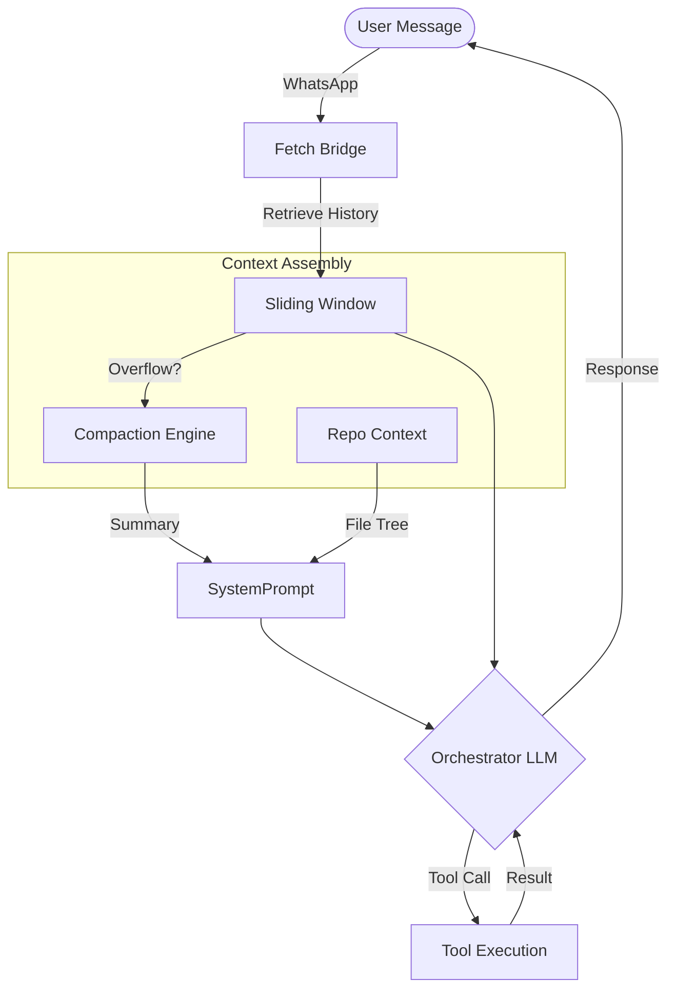

# Context Pipeline

> Fetch's memory system — how conversations persist across turns, how old context is compressed, and how tool call history stays visible to the LLM without leaking raw data to WhatsApp.

## Overview

The Context Pipeline solves a core problem in conversational AI: **multi-turn memory**. Without it, every message is a blank slate.

The pipeline applies three layers of memory:

1. **Sliding Window**: Last 20 messages (configurable) in full OpenAI format.
2. **Compaction**: Older messages are summarzied into a single system prompt section.
3. **Repo Map**: Current file structure and git status.

## Project Intelligence

Fetch automatically detects the project type when a workspace is selected to tune its responses (e.g., suggesting `npm test` vs `cargo test`).

### Supported Auto-Detection

* **Node.js** (`package.json`)
* **TypeScript** (`tsconfig.json`)
* **Python** (`requirements.txt`, `pyproject.toml`)
* **Rust** (`Cargo.toml`)
* **Go** (`go.mod`)
* **Java** (`pom.xml`, `build.gradle`)
* **Ruby** (`Gemfile`)
* **PHP** (`composer.json`)
* **DotNet** (`*.csproj`)

## Memory Lifecycle

The context pipeline handles message persistence and compaction automatically:

1. **Incoming Message**: Added to `sqlite` immediately.
2. **Context Construction**:
    * Fetch retrieves the last N messages (Sliding Window).
    * If total tokens > limit, older messages are compacted.
    * System prompt is assembled with "The Pack" tools and Identity.

### Compaction Engine

When the conversation exceeds `FETCH_COMPACTION_THRESHOLD` (default 40), the engine:

1. Takes all messages *outside* the sliding window.
2. Feeds them to a cheaper model (e.g. Gemini Flash).
3. Generates a bulleted summary.
4. Injects this summary into the `system` message.

This allows conversations to go on for hundreds of turns without overflowing the context window or racking up huge token costs.
