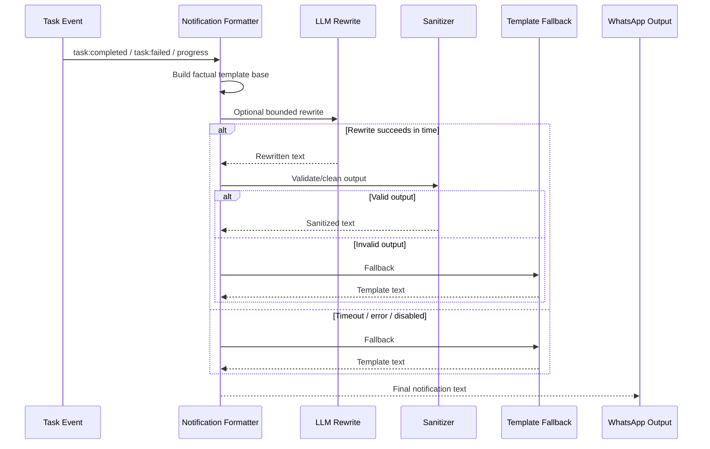

# Harness System

## Implementation References

- Harness core: `apps/bridge/src/harness/base.ts`, `apps/bridge/src/harness/registry.ts`, `apps/bridge/src/harness/spawner.ts`, `apps/bridge/src/harness/executor.ts`.
- Adapter implementations: `apps/bridge/src/harness/*.ts`.
- Kennel runtime: `kennel/Dockerfile`, `kennel/entrypoint.sh`, `docker-compose.yml`.
- Validation tests: `apps/bridge/tests/unit/harness-adapters.test.ts`, `apps/bridge/tests/unit/spawner.test.ts`.


> "The Pack" consists of specialized AI CLIs running inside the **Kennel** sandbox (Docker). The Orchestrator delegates complex tasks to these harnesses when simple file edits or tool calls aren't enough.

<!-- DIAGRAM:harness -->

## Core Components

The Harness System bridges the gap between the TypeScript-based Orchestrator (Bridge) and Python/Go/Rust CLIs running in an isolated environment.

### 1. Spawner (`harness/spawner.ts`)

Wraps every command in `docker exec`:

```typescript
// Conceptual
spawn('claude', args) ->
  docker exec -w /workspace/project fetch-kennel claude ...args
```

### 2. Adapters (`harness/*.ts`)

Each harness has an adapter in the `src/harness/` directory that extends `AbstractHarnessAdapter` (`base.ts`). The adapter defines:

* **Command**: The binary to run (`claude`, `gemini`, `gh`, `opencode`, `codex`).
* **Args**: Flags for non-interactive mode (`--print`, `--no-interaction`).
* **Parser**: Transforming raw stdout/stderr into structured `HarnessResult`.

**Adapter files:** `claude.ts`, `gemini.ts`, `copilot.ts`, `opencode.ts`, `codex.ts` — all extend `base.ts`.

**Supporting modules:**
* `registry.ts` — Maps harness names to adapter instances (single source of truth)
* `executor.ts` — Manages task execution lifecycle through the pool/spawner
* `spawner.ts` — Creates and manages child processes with `docker exec` wrapping
* `pool.ts` — Concurrency management (max 1, aligned with TaskManager)
* `output-parser.ts` — Parses harness CLI stdout/stderr into structured events
* `types.ts` — `HarnessConfig`, `ErrorCategory`, `HarnessResult` interfaces

## Source Responsibility Index

| File | Purpose |
|------|---------|
| `src/handler/index.ts` | Entry point for inbound WhatsApp messages, slash command routing, agent delegation, proactive task notifications |
| `src/harness/base.ts` | Shared adapter defaults for question detection, stdin formatting, and summary extraction |
| `src/harness/claude.ts` | Claude CLI adapter: config building and output parsing rules |
| `src/harness/gemini.ts` | Gemini CLI adapter: config building and output parsing rules |
| `src/harness/copilot.ts` | Copilot CLI adapter: config building and output parsing rules |
| `src/harness/opencode.ts` | OpenCode CLI adapter: config building and output parsing rules |
| `src/harness/codex.ts` | Codex CLI adapter with JSONL-oriented parsing |
| `src/harness/registry.ts` | Adapter lookup/registration for agent type to adapter mapping |
| `src/harness/executor.ts` | High-level execution coordinator over pool/spawner with lifecycle events |
| `src/harness/spawner.ts` | Low-level child process lifecycle, stream forwarding, timeout/kill handling |
| `src/harness/pool.ts` | Concurrency cap and FIFO queue for harness execution requests |
| `src/harness/output-parser.ts` | Line parser that emits structured events from raw stream output |
| `src/harness/types.ts` | Shared type contracts for adapters, events, execution state, and results |
| `src/harness/index.ts` | Public harness module exports |

## Available Harnesses

| Harness | CLI | Best For | CLI Config Injection |
|---------|-----|----------|---------------------|
| **Claude Code** | `claude` | Deep refactoring, multi-file edits, architectural analysis. | `--append-system-prompt /app/data/cli-configs/CLAUDE.md` |
| **Gemini CLI** | `gemini` | Quick fixes, explanations, boilerplate generation. | `GEMINI_SYSTEM_MD` env var |
| **Copilot CLI** | `gh copilot` | Shell commands, git workflows, explanations. | `COPILOT_CUSTOM_INSTRUCTIONS_DIRS` env var |
| **OpenCode** | `opencode` | Versatile coding, OpenRouter-native, general-purpose. | `OPENCODE_SYSTEM_PROMPT` env var |
| **Codex** | `codex` | Agentic coding with OpenAI models, JSON Lines streaming. | `--cd` flag sets working directory |

Each adapter's `buildConfig()` injects the CLI config file from `data/cli-configs/` so harnesses receive Fetch-specific behavioral instructions (e.g., no commits, structured output summaries).

### Official Install Docs

| Harness | Install / Setup Docs |
|---------|----------------------|
| Claude Code | https://docs.claude.com/en/docs/claude-code/getting-started |
| Gemini CLI | https://github.com/google-gemini/gemini-cli |
| GitHub Copilot CLI | https://docs.github.com/en/copilot/how-tos/set-up/install-copilot-cli |
| OpenCode | https://opencode.ai/docs/ |
| Codex CLI | https://help.openai.com/en/articles/11096431-openai-codex-ci-getting-started |

Prerequisite for most CLI harnesses: Node.js + npm  
https://nodejs.org/en/download/package-manager

### Project Context Injection

When a `ProjectProfile` is available, all adapters append a `--- Project Context ---` section to the task goal with language, framework, test/build commands, and entry points. This gives the harness CLI awareness of the project's toolchain without requiring it to discover this information itself.

## Hybrid LLM Notifications

Task completion and failure events are formatted by `agent/notifications.ts` using a cheap LLM call (configurable via `FETCH_NOTIFICATION_MODEL`) with the identity voice tone injected.

Safety boundaries for notification rewrites:

* Hard timeout (2s) on LLM notification generation.
* Output sanitization (max lines/chars, strip markdown/list artifacts).
* Automatic fallback to deterministic templates on timeout/error/invalid output.
* Runtime kill switch via `FETCH_NOTIFICATION_REWRITE=false`.

Started and progress task events use template pools with anti-repeat selection to reduce immediate repetition.

### Notification Rendering Sequence



## Error Classification

When a harness process fails, the executor classifies the error into one of six categories:

| Category | Detection |
|----------|-----------|
| `timeout` | Process killed or exit code 124/137 |
| `network` | stderr contains ECONNREFUSED, ENOTFOUND, etc. |
| `permission` | stderr contains "permission denied" or EACCES |
| `syntax` | stderr contains SyntaxError, TypeError, etc. |
| `process` | Non-zero exit code (generic) |
| `unknown` | Default fallback |

The `errorCategory` field on `HarnessResult` enables downstream systems to decide on retry strategy.

## Concurrency

The `HarnessPool` defaults to `maxConcurrent: 1`, aligned with `TaskManager`'s single-task-at-a-time model. Requests that arrive while a task is running are queued and processed in order.

## Docker Isolation

<!-- DIAGRAM:docker -->

All harnesses run inside the `fetch-kennel` container, which has:

* **Read-Write** access to the workspace (`./workspace`).
* **Read-Only** access to config (`~/.config/claude-code`, variable volumes).
* **No access** to the host system outside mounted volumes.
