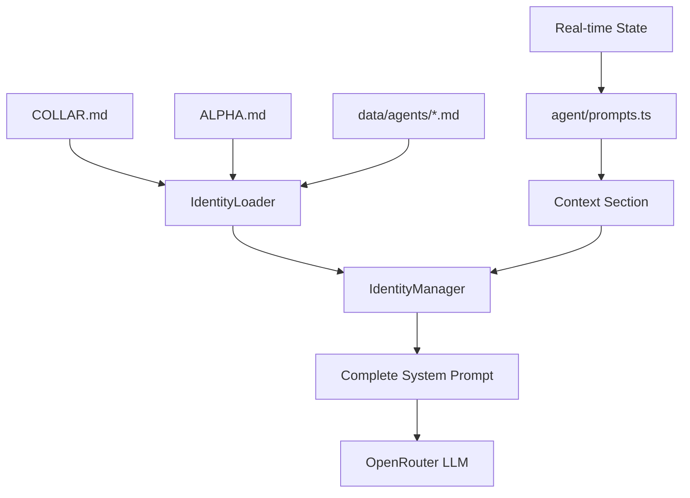

# Identity & Context System

Fetch's personality and situational awareness are not hardcoded. They are dynamically assembled from a set of Markdown files and real-time state.

## 🏗️ The Identity Stack

The system follows a layered approach to build the **System Prompt** for every LLM turn.

### 1. Data Sources (`data/identity/`)

These files are the single source of truth for Fetch's soul and the user's role.

- **[COLLAR.md](file:///home/traves/Development/1. Personal/Fetch/data/identity/COLLAR.md)**: Defines who Fetch is.
  - **Core Identity**: Name, Role, Emoji, Voice/Tone.
  - **Directives**: Primary rules (unbreakable), Operational guidelines, and Behavioral traits (personality quirks like hating lobsters).
  - **Communication Style**: Tone spectrum and formatting rules.
- **[ALPHA.md](file:///home/traves/Development/1. Personal/Fetch/data/identity/ALPHA.md)**: Defines who the User is.
  - User name, preferences, and authorization level.
- **[AGENTS.md](file:///home/traves/Development/1. Personal/Fetch/data/identity/AGENTS.md)**: Technical metadata for the Pack members (Claude, Gemini, Copilot).

### 2. Identity Loader (`identity/loader.ts`)

The **Loader** is responsible for parsing these Markdown files. It uses regex and heading markers to transform text sections into a structured `AgentIdentity` TypeScript object.

### 3. Identity Manager (`identity/manager.ts`)

The **Manager** is a singleton that orchestrates the final prompt assembly.

- **Hot-Reloading**: Uses `chokidar` to watch the files in `data/identity/`. If you edit `COLLAR.md` and save it, Fetch's personality updates instantly without a restart.
- **Assembly**: Calls `buildSystemPrompt()` which combines:
  1. Base Identity (from `COLLAR.md`)
  2. Autonomy Rules (High-priority behavior logic)
  3. Capabilities (Structured list of safety commands and tools)
  4. Dynamic Context (Real-time state)
  5. Pack Context (XML-wrapped agent profiles)

### 4. Dynamic Prompts (`agent/prompts.ts`)

While the Identity Manager handles the "Who", `prompts.ts` handles the "Where" and "What".

- **`buildContextSection`**: Injects the active workspace path, git status, active task goal, and the repository map into the prompt.
- **`buildTaskFramePrompt`**: A specialized prompt used only during `task_create`. It tells a "Task Framing" LLM how to turn a user's instruction into a bounded goal for a coding agent.

---

## 🔄 Data Flow

## 🧠 Why this matters

By separating **Identity** from **Context**:

1. **Fetch is consistent**: His voice and rules remain stable across different projects.
2. **Fetch is aware**: He always knows exactly which file you're talking about because `prompts.ts` feeds him the latest workspace state.
3. **Fetch is customizable**: You can change his personality or your own profile simply by editing Markdown files, making the agent feel truly personal.
