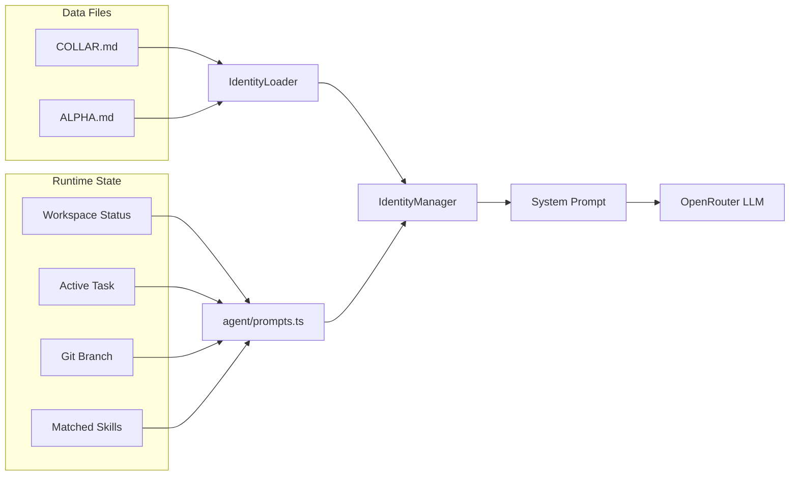

# Identity System

Fetch's personality, directives, and user context are dynamically assembled from two Markdown files on disk. Edit a file, save — changes apply immediately via hot-reload.

## The Identity Stack

Every LLM turn, Fetch builds a **system prompt** (budget-capped at ~6000 tokens, configurable via `FETCH_CONTEXT_BUDGET`) from these layers:



### System Prompt Structure

The final prompt assembles these sections in order:

| Section | Source | Content |
|---------|--------|---------|
| **Identity** | `COLLAR.md` | Name, emoji, version, voice tone, timestamp |
| **Directives** | `COLLAR.md` | Primary rules (5), operational guidelines (6), behavioral traits (6) |
| **Autonomy Rules** | Hardcoded | 9 high-priority behavioral assertions |
| **Capabilities** | Hardcoded | 5 slash commands, 27 tools, 3 harnesses |
| **Session Context** | `prompts.ts` | Active workspace path, git state, task goal, repo map |
| **Skills** | `SkillManager` | Available skills summary + activated skill instructions |
| **Response Format** | Hardcoded | WhatsApp constraints (max lines, emoji usage) |

The prompt **rebuilds automatically** after state-changing tools (`workspace_select`, `workspace_create`, `task_create`) so the LLM always sees current context.

---

## Data Files

### `data/identity/COLLAR.md` — Fetch's Soul

Defines who Fetch is. Parsed by `IdentityLoader` using regex on `## ` headings.

| Section | Fields | Example |
|---------|--------|---------|
| **Core Identity** | Name, Role, Emoji, Voice | `Name: Fetch`, `Voice: Confident, concise, warm` |
| **Primary Directives** | 5 unbreakable rules | "Protect the codebase", "Never hallucinate" |
| **Operational Guidelines** | 6 work rules | "Fetch context before acting", "One task at a time" |
| **Behavioral Traits** | 6 personality quirks | "Eager but disciplined", "Hates lobsters" |
| **Communication Style** | Tone spectrum table | 8 situations with specific tone/example |
| **Instincts** | Auto-response triggers | `/stop` → cancel, destructive op → warn |

**To customize:** Edit any section and save. Hot-reload picks up changes in seconds.

### `data/identity/ALPHA.md` — User Profile

Defines who the user is and how Fetch relates to them.

| Section | Purpose |
|---------|---------|
| **User Profile** | Name, role, authority level |
| **Relationship Model** | Subordinate dynamic (loyalty, initiative, deference) |
| **Working Preferences** | Communication style, code style, git conventions |
| **Approval Preferences** | What needs confirmation vs what Fetch can do autonomously |
| **Project Context** | Primary stack, deploy target, editor, AI tools |

> [!NOTE]
> The loader extracts the owner **name** as structured data. All other content is included as raw markdown in the system prompt — the LLM reads it directly.

---

## CLI Config Templates

Each harness CLI has its own native instruction format. Templates are stored in `data/cli-configs/` and are **automatically injected** by the harness adapters during `buildConfig()`:

| CLI | Config File | Injection Mechanism |
|-----|------------|-----------|
| **Claude Code** | `CLAUDE.md` | `--append-system-prompt /app/data/cli-configs/CLAUDE.md` arg |
| **Gemini CLI** | `GEMINI.md` | `GEMINI_SYSTEM_MD=/app/data/cli-configs/GEMINI.md` env var |
| **Copilot CLI** | `copilot-instructions.md` | `COPILOT_CUSTOM_INSTRUCTIONS_DIRS=/app/data/cli-configs` env var |

These templates tell each CLI that it's operating inside the Fetch Kennel, should not commit, and should output structured change summaries. The config file path points to the container-internal mount (`/app/data/cli-configs/`) since execution happens via `docker exec` in the Kennel.

---

## Harness Selection

When a user requests a coding task, the LLM selects which harness to use based on:

1. **Enabled adapters** — Only harnesses toggled on via `ENABLE_CLAUDE`, `ENABLE_GEMINI`, `ENABLE_COPILOT` are available
2. **Task context** — The LLM reads the task description and uses its own judgment
3. **Skill hints** — Activated skills provide `harness_hint` attributes to nudge routing
4. **Ambiguity rule** — If multiple harnesses are enabled and the request is ambiguous, Fetch asks the user before delegating

Manual override is always available: `@fetch use claude: <task>`.

---

## Context Budget

The system prompt is assembled with a token budget to prevent context overflow:

- **Budget**: `FETCH_CONTEXT_BUDGET` (default: 6000 tokens, configurable via pipeline)
- **Estimation**: `Math.ceil(text.length / 4)` heuristic (industry-standard approximation)
- **Truncation order** (when over budget):
  1. Session context (contains repo map, the largest variable section)
  2. Activated skill instructions (keeps summary, drops long bodies)
- A warning is logged when truncation occurs

---

## Identity Loading

### Async File I/O

The `IdentityLoader` uses an **async `load()` method** (changed from synchronous in v4.3.0):

```typescript
async load(): Promise<AgentIdentity> {
  const collarContent = await fs.promises.readFile(collarPath, 'utf-8');
  const alphaContent = await fs.promises.readFile(alphaPath, 'utf-8');
  // ... parsing logic
}
```

This prevents blocking the event loop during startup when reading identity files. The loader uses:
- `fs.promises.readFile()` for non-blocking file reads
- Structured logger (`logger.info`, `logger.error`) replacing `console.warn`/`console.error`
- Error handlers on all file operations

---

## Hot-Reload

The `IdentityManager` watches files via `chokidar`:

- **Watched directory:** `data/identity/`
- **Events:** File add, change, unlink
- **Propagation:** `reloadIdentity()` merges new values into in-memory state
- **Effect:** Next LLM call uses the updated prompt automatically
- **No restart needed** — edit, save, send a message
- **Error handling:** Watcher errors are logged but non-fatal; hot-reload continues on subsequent file changes
- **Shutdown:** `shutdown()` method closes all watcher file descriptors

---

## Customization Guide

### Change Fetch's personality
Edit `data/identity/COLLAR.md` → modify the **Behavioral Traits** section.

### Change the user profile
Edit `data/identity/ALPHA.md` → update **Working Preferences** or **Approval Preferences**.

### Customize CLI agent instructions
Edit files in `data/cli-configs/` to change what each harness CLI sees as its system instructions inside the Kennel container.
