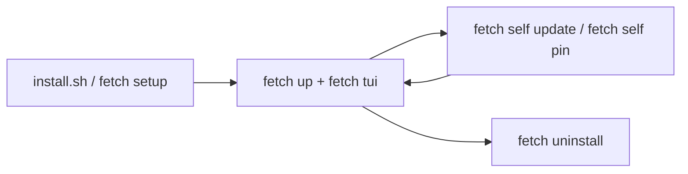

# Install, Uninstall & Update

## Implementation References

- Lifecycle scripts: `scripts/install.sh`, `scripts/fetch-cli.sh`, `scripts/uninstall.sh`, `scripts/build_manager.sh`.
- Release metadata: `release-manifest.json`, `VERSION`.
- Validation tests: `fetch-app/tests/unit/index-runtime.test.ts`.




## Quick Install (curl)

```bash
curl -fsSL https://raw.githubusercontent.com/Traves-Theberge/Fetch/main/scripts/install.sh | bash
```

The installer now auto-updates your shell profile PATH when needed.
If `fetch` is not found in your current shell, run:

```bash
export PATH="$HOME/.local/bin:$PATH"
echo 'export PATH="$HOME/.local/bin:$PATH"' >> ~/.bashrc   # bash
# echo 'export PATH="$HOME/.local/bin:$PATH"' >> ~/.zshrc  # zsh
# fish_add_path $HOME/.local/bin                           # fish
```

Installer behavior:
- Installs Fetch under `~/.fetch/repo`
- Creates `~/.local/bin/fetch` symlink
- Creates `.env` from `.env.example` if missing
- Resolves target release from `release-manifest.json`
- Verifies downloaded release archive with SHA-256 before install
- Uses staged activation with rollback to previous install if post-install steps fail
- Builds `manager/fetch-manager` if Go is installed

## Prerequisites

Required on host:
- `git`
- `curl`
- `docker` + `docker compose` plugin

Docker permission check (required before `fetch up`):

```bash
docker ps
```

If it fails with `permission denied`:

```bash
sudo systemctl enable --now docker
sudo usermod -aG docker $USER
newgrp docker
docker ps
```

Optional:
- `go` (required for manager rebuilds)
- `node` + `npm` (required to install/update harness CLIs)
- `gh` GitHub CLI (required host prerequisite for Copilot auth/workflows)

Node/npm install docs:
- https://nodejs.org/en/download/package-manager
- https://docs.npmjs.com/downloading-and-installing-node-js-and-npm

## CLI Management

```bash
fetch setup
fetch setup --install-gh-cli
fetch setup --install-prereqs --install-gh-cli --install-harnesses
fetch self doctor
fetch self doctor --json
fetch self version
fetch self update
fetch self update --channel beta
fetch self pin <version>
fetch config validate
fetch config doctor
fetch harness status
fetch harness install all
fetch harness uninstall codex
fetch uninstall
```

Exact manifest version pin:

```bash
fetch self pin v0.0.93
```

## Service Lifecycle

```bash
fetch up
fetch status
fetch logs
fetch down
fetch tui
```

Service command targeting:

- `fetch up/down/status/logs` operate on the Fetch repo in your current working directory when that directory contains a Fetch `docker-compose.yml`.
- If no local repo is detected, commands fall back to the managed install repo at `~/.fetch/repo`.
- Fetch uses a stable Compose project name (`fetch`) so service/container names stay consistent across local repo and managed install paths.
- `fetch up` now streams Docker Compose progress live and prints explicit startup/success status lines.
- If `GH_TOKEN` is missing in `.env`, `fetch up` will try to sync it from host `gh auth token` automatically.

## Legacy Migration

The old root installer logic was removed. `./install.sh` now delegates to `scripts/install.sh`.

If you previously ran a repo-local install, run:

```bash
./scripts/install.sh
```

This updates symlinks and keeps your existing repo/config.

### Migration from older repo-local installs

If your old setup lived in `~/fetch` (or another custom path), migrate to the managed layout:

```bash
FETCH_HOME=~/.fetch ./scripts/install.sh --ref main
```

Then verify:

```bash
fetch self version
fetch self doctor
```

## Fork/Enterprise Override (Optional)

For forks or internal mirrors, override the repository slug used by installer/update scripts:

```bash
export FETCH_REPO_SLUG="your-org/Fetch"
curl -fsSL https://raw.githubusercontent.com/your-org/Fetch/main/scripts/install.sh | bash
```

You can also override the manifest endpoint directly:

```bash
export FETCH_MANIFEST_URL="https://raw.githubusercontent.com/your-org/Fetch/main/release-manifest.json"
fetch self update
```

## Uninstall

```bash
fetch uninstall
fetch uninstall --with-docker --with-deps --clean-path
```

Use `fetch uninstall --help` for all removal options and flags.

## Security

See [Security Runbook](SECURITY_RUNBOOK.md) for production hardening and recovery guidance.
