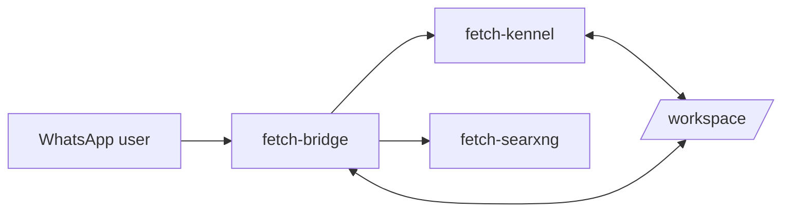

# Overview

## Implementation References

- Runtime: `fetch-app/src/index.ts`, `fetch-app/src/handler/index.ts`, `fetch-app/src/tools/registry.ts`.
- Operations: `scripts/fetch-cli.sh`, `manager/main.go`.
- Infra/versioning: `docker-compose.yml`, `.env.example`, `VERSION`, `release-manifest.json`.
- Validation tests: `fetch-app/tests/unit/index-runtime.test.ts`, `fetch-app/tests/integration/agent-loop.test.ts`.

Fetch is a self-hosted coding orchestrator controlled from WhatsApp.

It runs as a dual-container system:

- `fetch-bridge` handles WhatsApp message processing, LLM orchestration, and tool routing
- `fetch-kennel` executes coding and browser tasks in a sandboxed runtime
- `fetch-searxng` provides web search for `web_search`

Core workflow:

1. Send a WhatsApp message with `@fetch`
2. Fetch applies safety checks and command routing
3. The agent decides between direct response, tool calls, or delegated harness execution
4. Results are returned in chat, with task/session state persisted for continuity

Start with:

- [Setup Guide](SETUP_GUIDE.md)
- [Install, Uninstall & Update](INSTALL_UNINSTALL_UPDATE.md)
- [Command Reference](COMMANDS.md)
