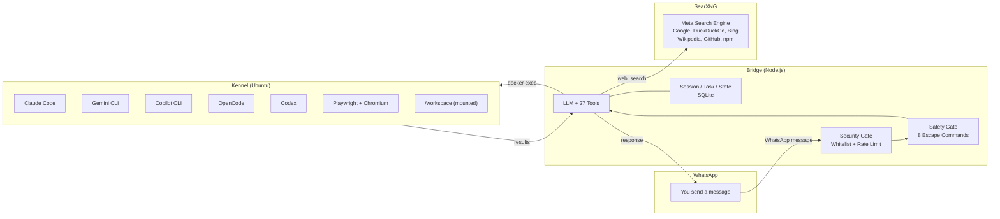

```
  ⠀⠀⠀⠀⠀⠀⠀⢀⣠⣤⣠⣶⠚⠛⠿⠷⠶⣤⣀⡀⠀⠀⠀⠀⠀⠀⠀⠀⠀⠀
  ⠀⠀⠀⠀⠀⢀⣴⠟⠉⠀⠀⢠⡄⠀⠀⠀⠀⠀⠉⠙⠳⣄⠀⠀⠀⠀⠀⠀⠀⠀
  ⠀⠀⠀⢀⡴⠛⠁⠀⠀⠀⠀⠘⣷⣴⠏⠀⠀⣠⡄⠀⠀⢨⡇⠀⠀⠀⠀⠀⠀⠀
  ⠀⠀⠀⠺⣇⠀⠀⠀⠀⠀⠀⠀⠘⣿⠀⠀⠘⣻⣻⡆⠀⠀⠙⠦⣄⣀⠀⠀⠀⠀
  ⠀⠀⠀⢰⡟⢷⡄⠀⠀⠀⠀⠀⠀⢸⡄⠀⠀⠀⠀⠀⠀⠀⠀⠀⠀⠉⢻⠶⢤⡀
  ⠀⠀⠀⣾⣇⠀⠻⣄⠀⠀⠀⠀⠀⢸⡇⠀⠀⠀⠀⠀⠀⠀⠀⠀⠀⠀⠸⣀⣴⣿
  ⠀⠀⢸⡟⠻⣆⠀⠈⠳⢄⡀⠀⠀⡼⠃⠀⠀⠀⠀⠀⠀⠀⠀⠀⠶⠶⢤⣬⡿⠁
  ⠀⢀⣿⠃⠀⠹⣆⠀⠀⠀⠙⠓⠿⢧⡀⠀⢠⡴⣶⣶⣒⣋⣀⣀⣤⣶⣶⠟⠁⠀
  ⠀⣼⡏⠀⠀⠀⠙⠀⠀⠀⠀⠀⠀⠀⠙⠳⠶⠤⠵⣶⠒⠚⠻⠿⠋⠁⠀⠀⠀⠀
  ⢰⣿⡇⠀⠀⠀⠀⠀⠀⠀⣆⠀⠀⠀⠀⠀⠀⠀⢠⣿⠀⠀⠀⠀⠀⠀⠀⠀⠀⠀
  ⢿⡿⠁⠀⠀⠀⠀⠀⠀⠀⠘⣦⡀⠀⠀⠀⠀⠀⢸⣿⠀⠀⠀⠀⠀⠀⠀⠀⠀⠀
  ⠀⠀⠀⠀⠀⠀⠀⠀⠀⠀⠀⠈⠻⣷⡄⠀⠀⠀⠀⣿⣧⠀⠀⠀⠀⠀⠀⠀⠀⠀
  ⠀⠀⠀⠀⠀⠀⠀⠀⠀⠀⠀⠀⠀⠈⢷⡀⠀⠀⠀⢸⣿⡄⠀⠀⠀⠀⠀⠀⠀⠀
  ⠀⠀⠀⠀⠀⠀⠀⠀⠀⠀⠀⠀⠀⠀⠀⠀⠀⠀⠀⠸⣿⠇⠀⠀⠀⠀⠀⠀⠀⠀

  F E T C H    v4.6.1
```

**Unleash Multi-agent orchestration.**

Fetch is the Alpha of your AI workforce. Acting as the Pack Leader, it chats with you on WhatsApp to understand your goals, then commands a squad of specialized agents—Claude Code, Gemini, Copilot, and more—to execute complex coding tasks inside sandboxed Docker containers.

---

## How It Works



1. You send a message on WhatsApp
2. **Security Gate** verifies sender (phone whitelist + rate limiting)
3. **Safety Gate** checks for escape commands (`/stop`, `/undo`, `/clear`, `/help`, `/status`, `/version`, `/usage`, `/trust`)
4. Everything else goes to the **LLM** with all 27 tools available
5. The LLM decides: respond, call tools, or delegate to a harness
6. For coding tasks, a CLI agent is spawned in the **Kennel** via `docker exec`
7. Results are formatted and sent back via WhatsApp

## Architecture

| Container | Tech | Role |
|-----------|------|------|
| **Bridge** | Node.js / TypeScript | WhatsApp client, agent core, 27 orchestrator tools, session/task persistence |
| **Kennel** | Ubuntu | Sandboxed env with Claude Code, Gemini CLI, Copilot CLI, OpenCode, Codex, Playwright + Chromium |
| **SearXNG** | Meta search engine | Self-hosted search aggregator (Google, DuckDuckGo, Bing, Wikipedia, GitHub, npm) |
| **Manager** | Go / Bubble Tea | TUI for managing services, configuring env vars, viewing logs |

## Features

**Core**
- **LLM-First** — Every message goes directly to the LLM with all 27 tools. No pre-classification, no regex routing
- **8 Safety Escapes** — `/stop`, `/undo`, `/clear`, `/help`, `/status`, `/version`, `/usage`, `/trust` are deterministic
- **Live Context** — System prompt rebuilt after every state-changing tool call
- **Five Harnesses** — Claude Code, Gemini CLI, Copilot CLI, OpenCode, Codex with process lifecycle management
- **Structured Memory** — Cross-session recall with BM25-style keyword matching, chained compaction summaries
- **Pipeline Tuning** — 42 parameters via `FETCH_*` env vars, no code changes needed

**Tools & Capabilities**
- **27 Orchestrator Tools** — Workspace management, task lifecycle, GitHub operations, web fetch, web search, browser automation
- **Web Fetch & Search** — Readability + Turndown for pages, self-hosted SearXNG for search (no API keys)
- **Browser Automation** — Headless Chromium via Playwright with accessibility tree snapshots
- **Voice & Vision** — Voice notes transcribed via whisper.cpp, image analysis via vision model
- **GitHub Auto-Sync** — Commits, pushes, and auto-creates repos on workspace creation

**System**
- **Dynamic Identity** — Hot-reloaded personality from Markdown files in `data/identity/`
- **Skills Framework** — Teach new capabilities by adding Markdown to `data/skills/`
- **Crash Recovery** — State persisted to SQLite, resumes after restart
- **10 Project Types** — Auto-detects Node, TypeScript, Python, Rust, Go, Java, Ruby, PHP, .NET
- **Docker Hardening** — Healthchecks, resource limits, log rotation, shell injection prevention

## Quick Start

```bash
# Prerequisites: Node.js 20+, Docker, Go 1.21+
./setup-dev.sh

# Or manually:
cd fetch-app && npm install && npm run build
cd manager && go build -o fetch-manager .

# Start everything
./deploy.sh

# Scan the QR code from bridge logs
docker logs -f fetch-bridge
```

Required env vars: `OPENROUTER_API_KEY`, `OWNER_PHONE_NUMBER`

See [Setup Guide](docs/markdown/SETUP_GUIDE.md) for full instructions.

## Documentation

| Guide | Description |
|-------|-------------|
| [Setup Guide](docs/markdown/SETUP_GUIDE.md) | Installation and first run |
| [TUI Guide](docs/markdown/TUI_GUIDE.md) | Manager terminal interface |
| [Commands](docs/markdown/COMMANDS.md) | Safety escapes and usage examples |
| [Configuration](docs/markdown/CONFIGURATION.md) | Environment variables and config files |
| [Architecture](docs/markdown/ARCHITECTURE.md) | System design, data flow, concurrency patterns |
| [Harness System](docs/markdown/HARNESS_SYSTEM.md) | CLI adapter lifecycle and process management |
| [Identity System](docs/markdown/IDENTITY_SYSTEM.md) | Dynamic persona, directives, and CLI config templates |
| [Skills Guide](docs/markdown/SKILLS_GUIDE.md) | Building and loading skill plugins |
| [Context Pipeline](docs/markdown/CONTEXT_PIPELINE.md) | Message windowing, compaction, prompt assembly |
| [State Management](docs/markdown/STATE_MANAGEMENT.md) | SQLite persistence, singleton patterns, shutdown |
| [API Reference](docs/markdown/API_REFERENCE.md) | Tool interfaces and HTTP endpoints |
| [Changelog](CHANGELOG.md) | Version history and release notes |

## Development

```bash
# Bridge (TypeScript)
cd fetch-app
npm run dev          # run with ts-node
npm run build        # compile to dist/
npm run lint         # eslint
npm run test:run     # all tests (360 passing)
npm run test:unit    # unit tests only

# Manager (Go TUI)
cd manager
go build -o fetch-manager .
./fetch-manager

# Docker
./deploy.sh                    # build + start
docker compose down            # stop
docker logs -f fetch-bridge    # bridge logs
```

## License

MIT
