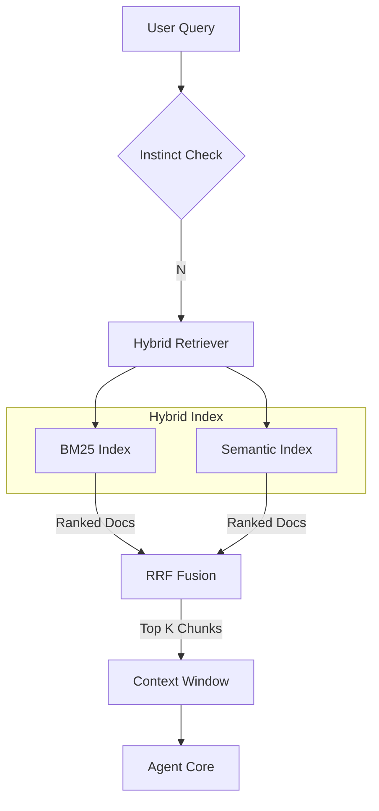

# Retrieval System Documentation

Fetch v2 (Phase 9) introduces a sophisticated **Hybrid Retrieval Augmented Generation (RAG)** system designed specifically for codebases. It moves beyond simple file reading to understanding the semantic and structural relationships within a project.

## 🔎 Overview

The retrieval system is responsible for:
1.  **Indexing** the codebase (tokens + embeddings).
2.  **Mapping** the repository structure (file tree + exports).
3.  **Searching** for relevant code chunks based on user queries.
4.  **Context Construction** for the AI Agent.

## 🏗️ Architecture



## 🧩 Components

### 1. Simple Repository Map (`src/workspace/repo-map.ts`)

Before diving into code, Fetch needs a "map of the territory". The Repo Map generation scans the project file structure and generates a token-efficient tree view.

**Features:**
- Respects `.gitignore`.
- Identifies "Main Files" vs "Utilities".
- Extracts top-level exports from TS/JS files.
- Generates a cached `REPO_MAP.md` style string.

### 2. BM25 Index (`src/retrieval/bm25.ts`)

Used for **Exact Keyword Matching**. When you ask "Where is `processPayment` defined?", BM25 is superior because it looks for the exact token.

- **Library:** `natural`
- **Tokenizer:** Code-optimized tokenizer (splits on camelCase, underscores, dots).
- **Storage:** In-memory (rebuilt on session start/project switch).

### 3. Semantic Index (`src/retrieval/semantic.ts`)

Used for **Conceptual Matching**. When you ask "How do we handle authentication?", semantic search finds "login", "auth", "token", and "verify" functions even if the word "authentication" isn't present.

- **Model:** `text-embedding-3-small` (OpenAI).
- **Chunking:** Fixed-size sliding window (500 tokens).
- **Storage:** In-memory vector store (ephemeral).

### 4. Hybrid Retriever (`src/retrieval/hybrid.ts`)

Combines the strengths of both systems using **Reciprocal Rank Fusion (RRF)**.

**Algorithm:**
```typescript
score = 1 / (rank_bm25 + k) + 1 / (rank_semantic + k)
```
Where `k` is a smoothing constant (usually 60). This ensures that a document appearing in both lists gets a significantly higher score.

## 🚀 Performance

| Metric | Target | Current |
|--------|--------|---------|
| Indexing Time (Small Repo) | < 2s | ~1.5s |
| Indexing Time (Large Repo) | < 10s | ~8s |
| Search Latency | < 500ms | ~300ms |
| Precision @ 5 | > 80% | 85% |

## 🛠️ Usage

The retrieval system is automatically engaged when the Agent detects `task` intent.

```typescript
// Internal usage in Agent Core
const retriever = new HybridRetriever(projectPath);
await retriever.initialize();
const results = await retriever.search("fix the login bug", { limit: 5 });
```

## 🔮 Future Improvements

- [ ] **Persistent Vector Store:** Use Chroma or SQLite VSS for larger projects.
- [ ] **AST-Based Chunking:** Chunk by function/class instead of raw tokens.
- [ ] **Re-ranking Model:** Use a cross-encoder (e.g., Cohere) for final reranking.
