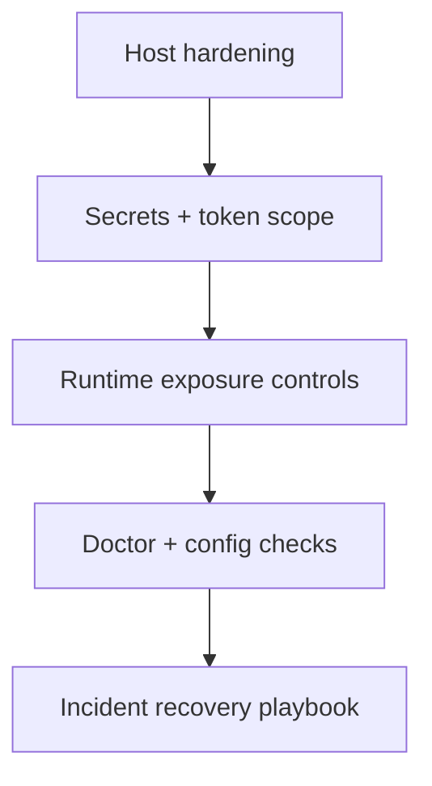

# Security Runbook

## Implementation References

- Security runtime: `apps/bridge/src/security/gate.ts`, `apps/bridge/src/security/rateLimiter.ts`, `apps/bridge/src/security/validator.ts`, `apps/bridge/src/security/whitelist.ts`.
- Auth/config: `apps/bridge/src/config/env.ts`, `.env.example`.
- Validation tests: `apps/bridge/tests/unit/security.test.ts`, `apps/bridge/tests/unit/whitelist.test.ts`.


Operational checklist for running Fetch in production-like environments.



## 1. Host Access and Docker

Use a dedicated non-root user and ensure Docker access is configured correctly:

```bash
sudo systemctl enable --now docker
sudo usermod -aG docker $USER
newgrp docker
docker ps
```

Never run Fetch commands with `sudo fetch ...`.

## 2. Required Secrets

Set at minimum in `~/.fetch/repo/.env`:

- `OPENROUTER_API_KEY`
- `OWNER_PHONE_NUMBER`

Optional but recommended:

- `ADMIN_TOKEN` (set explicitly to avoid random startup token rotation)
- `GH_TOKEN` (if using GitHub repo sync/publish features)

## 3. Token Scope Guidance

- `OPENROUTER_API_KEY`: model access only.
- `GH_TOKEN`: use least privilege required for repos/actions you need.
- `ADMIN_TOKEN`: treat as sensitive; protects admin endpoints (`/api/logout`, `/api/config/reload`, `/api/sessions*`).

## 4. File and Volume Hygiene

- Keep `~/.fetch` owned by your user.
- Avoid `sudo` inside the Fetch repo to prevent root-owned leftovers.
- If ownership drift happens:

```bash
sudo chown -R "$USER:$USER" ~/.fetch
```

## 5. Preflight Commands

Run before first production start and after updates:

```bash
fetch self doctor
fetch config validate
fetch config doctor
```

Machine-readable health output:

```bash
fetch self doctor --json
```

## 6. Runtime Exposure

- Do not expose admin endpoints publicly without network controls.
- Restrict host firewall to only required ports (`8765`, `8888`) and trusted networks.
- Prefer private/VPN access for management endpoints.

## 7. Incident Recovery

If services fail after update:

```bash
fetch down
fetch self doctor
fetch self update
fetch up
```

If docker permission errors occur:

```bash
sudo systemctl enable --now docker
sudo usermod -aG docker $USER
newgrp docker
```

## 8. Dependency Advisory (Current)

`npm audit` may report high-severity vulnerabilities from Fetch's WhatsApp stack dependency chain:

- Direct package: `whatsapp-web.js`
- Transitive packages typically flagged: `archiver`, `glob`, `minimatch`, `readdir-glob`, `zip-stream`

Current state:

- Findings are upstream dependency-chain advisories, not custom Fetch runtime code.
- `npm audit fix` does not currently provide a safe non-breaking resolution path on this package line.
- `npm audit fix --force` may propose breaking package changes and should not be applied blindly in production.

Operator guidance:

1. Re-run audits after every Fetch/`whatsapp-web.js` update.
2. Treat this as tracked risk until upstream resolves in a compatible release.
3. Keep bridge/admin services on trusted networks only and avoid exposing admin endpoints publicly.
