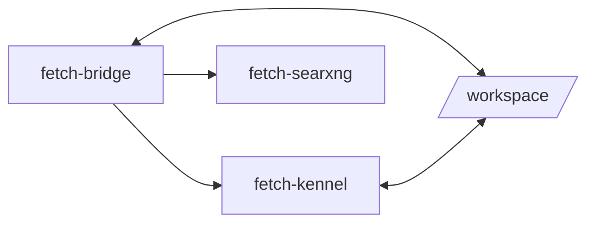

# Setup Guide

## Implementation References

- Setup/install scripts: `scripts/install.sh`, `scripts/fetch-cli.sh`, `scripts/install_prereqs.sh`, `scripts/install_gh_cli.sh`.
- Runtime orchestration: `manager/main.go`, `manager/internal/status/client.go`.
- Infra/config: `docker-compose.yml`, `config/searxng/settings.yml`, `.env.example`.
- Validation tests: `apps/bridge/tests/unit/env-runtime-validation.test.ts`.


## Prerequisites

| Requirement | Version | Notes |
|-------------|---------|-------|
| Linux host | Debian/Ubuntu | Recommended OS |
| OpenRouter Key | — | Required for LLM access ([openrouter.ai](https://openrouter.ai)) |
| WhatsApp Account| — | Required for primary interface |
| Node.js + npm | Node 20+ recommended | Needed to install/update harness CLIs on host |
| GitHub CLI (`gh`) | latest | Required host prerequisite for Copilot CLI auth and GitHub workflow tooling |

> **Note:** The canonical installer is `scripts/install.sh` (also accessible through root `install.sh` wrapper).

## Raspberry Pi (Ubuntu 64-bit) Quick Setup

Use this flow on a Raspberry Pi running Ubuntu Server/Desktop 64-bit.

### 1. Prepare the host

```bash
sudo apt update && sudo apt upgrade -y
sudo apt install -y git curl ca-certificates gnupg lsb-release tar python3 python3-pip nodejs npm
```

### 2. Install Docker + Compose plugin

```bash
curl -fsSL https://get.docker.com | sh
sudo usermod -aG docker $USER
newgrp docker
docker --version
docker compose version
docker ps
```

If `docker ps` fails with `permission denied`, run:

```bash
sudo systemctl enable --now docker
sudo usermod -aG docker $USER
newgrp docker
docker ps
```

### 3. Install Go (recommended)

```bash
sudo apt install -y golang-go
go version
```

### 4. Install Fetch

```bash
curl -fsSL https://raw.githubusercontent.com/Traves-Theberge/Fetch/main/scripts/install.sh | bash
```

### 5. Ensure `fetch` is on your PATH

Installer auto-updates PATH in your shell profile when needed. If current shell has not reloaded yet:

```bash
echo 'export PATH="$HOME/.local/bin:$PATH"' >> ~/.bashrc
source ~/.bashrc
which fetch
```

### 6. Configure and start

```bash
nano ~/.fetch/repo/.env
fetch setup --install-gh-cli
fetch setup --install-prereqs --install-gh-cli --install-harnesses
fetch up
fetch tui
```

Set at minimum:

```env
OWNER_PHONE_NUMBER=15551234567
OPENROUTER_API_KEY=sk-or-...
ADMIN_TOKEN=replace-with-long-random-token
```

`ADMIN_TOKEN` is strongly recommended for TUI Global Sessions and admin API actions. Without an explicit token, session management can fail after restarts due to token rotation.

Optional GitHub repo sync without Copilot:

```env
GH_TOKEN=ghp_xxx
ENABLE_COPILOT=false
```

## Installation

### 1. Install

```bash
curl -fsSL https://raw.githubusercontent.com/Traves-Theberge/Fetch/main/scripts/install.sh | bash
fetch self doctor
```

### 2. Configure Environment

```bash
nano ~/.fetch/repo/.env
```

Set your critical variables:

```env
OWNER_PHONE_NUMBER=15551234567
OPENROUTER_API_KEY=sk-or-...
ADMIN_TOKEN=replace-with-long-random-token
```

### 3. Authenticate Harnesses (Optional)

Fetch uses CLI tools on your host for AI coding tasks. You should authenticate the ones you plan to use:

Node/npm install docs:
- https://nodejs.org/en/download/package-manager
- https://docs.npmjs.com/downloading-and-installing-node-js-and-npm

- **GitHub Copilot CLI** (install + auth): https://docs.github.com/en/copilot/how-tos/set-up/install-copilot-cli
- **Claude Code** (install + auth): https://docs.claude.com/en/docs/claude-code/getting-started
- **Gemini CLI** (install): https://github.com/google-gemini/gemini-cli
- **OpenCode** (install): https://opencode.ai/docs/
- **Codex CLI** (install + auth): https://help.openai.com/en/articles/11096431-openai-codex-ci-getting-started

Install GitHub CLI explicitly if needed:

```bash
fetch setup --install-gh-cli
fetch harness install all
gh --version
```

Common login commands after install:

- `gh auth login`
- `claude login`
- Set `GEMINI_API_KEY` in `.env`
- `opencode auth login`
- `codex --login`

The Manager TUI's **🐕 Harnesses** screen helps manage this state.
You can also install/uninstall each harness directly in TUI (`n`/`u` on selected harness).

### 4. Start Fetch

Use the Manager TUI to manage the system.

```bash
fetch tui
```

Select **🚀 Start Fetch** to launch the Docker containers.

### 5. Authenticate WhatsApp

On first launch, Fetch keeps WhatsApp disconnected until pairing is explicitly requested from the TUI.

- In the TUI: Select **📱 Setup WhatsApp**.
- Scan the QR code with your phone (Settings → Linked Devices).

### 6. Send Your First Message

Open WhatsApp and send:

```
@fetch hello
```

Fetch should respond with a greeting. Then try:

```
@fetch what projects are in my workspace?
@fetch /status
```

## GitHub Integration (Optional)

If you set `GH_TOKEN` in your `.env`, the Kennel container automatically configures GitHub CLI auth and git identity at startup via its entrypoint script. This enables:

- **`workspace_create`** — Automatically creates a GitHub repo and pushes the initial commit
- **`workspace_sync`** — Commits and pushes changes to the remote

No manual `gh auth login` is needed inside the container.
You can keep GitHub repo operations enabled while setting `ENABLE_COPILOT=false`.

## Docker Architecture

<!-- DIAGRAM:docker -->



```
docker compose up -d
```

This starts three containers:

| Container | Image | Ports | Volumes |
|-----------|-------|-------|---------|
| `fetch-bridge` | `apps/bridge/Dockerfile` | 8765 (status API) | `./data`, `./workspace`, `./docs` (ro), `./.env` (ro), `/var/run/docker.sock` (ro) |
| `fetch-kennel` | `kennel/Dockerfile` | — | `./workspace`, `~/.config/gh` (ro), `~/.config/claude-code` (ro), `~/.claude` (ro), `~/.gemini` (ro), `~/.config/opencode` (ro), `~/.codex` (ro) |
| `fetch-searxng` | `searxng/searxng:latest` | 8888 (search API) | `./config/searxng` |

The Bridge talks to the Kennel by spawning CLI processes inside it via `docker exec`. Auth credentials are mounted read-only. SearXNG provides the web search backend on the Docker network.

## Pipeline Tuning (Optional)

Fetch's context pipeline has dozens of tunable parameters with sane defaults. Override via environment variables for quick adjustments:

| Variable | Default | Description |
|----------|---------|-------------|
| `FETCH_HISTORY_WINDOW` | `20` | Messages in the LLM sliding window |
| `FETCH_COMPACTION_THRESHOLD` | `40` | Compact when total messages exceed this |
| `FETCH_COMPACTION_MAX_TOKENS` | `500` | Max tokens for compaction summaries |
| `FETCH_MAX_TOOL_CALLS` | `5` | Max tool call rounds per message |
| `FETCH_TOOL_MAX_TOKENS` | `2048` | Token budget for tool-calling responses |
| `FETCH_TOOL_TEMPERATURE` | `0.3` | Temperature for tool-calling responses |

Add these to your `.env` file or use the TUI Manager's **⚙️ Settings** editor (Advanced tab) which shows all pipeline parameters with defaults. See `config/pipeline.ts` for the full list.

## Verifying the Installation

1. **Check container status**: `docker compose ps` — bridge, kennel, and searxng should be `running`
2. **Check Bridge health**: `curl http://localhost:8765/api/status`
3. **Check logs**: `docker logs fetch-bridge`
4. **Send a test message**: `@fetch ping` on WhatsApp

## Troubleshooting

| Problem | Solution |
|---------|----------|
| QR code not appearing | Open **Setup WhatsApp** first, then press `r` to request a fresh QR session; if still failing, check `docker logs fetch-bridge` |
| "Not authorized" response | Verify `OWNER_PHONE_NUMBER` matches your WhatsApp number exactly |
| `http://localhost:8765/docs` unreachable | Check `docker compose ps` and `docker logs fetch-bridge`; ensure bridge process is running and restart with `fetch up` after fixing `.env` |
| Bridge stuck restarting with missing env errors | Set required keys in `.env` (`OPENROUTER_API_KEY`, `OWNER_PHONE_NUMBER`) and restart |
| Harness not found | Ensure the CLI is installed in the Kennel and auth is mounted |
| Container won't start | Check `.env` for syntax errors; run `docker compose logs` |
| WhatsApp disconnects | Fetch auto-reconnects with exponential backoff (up to 10 retries) |

## Updating

Use the Fetch CLI:

```bash
fetch self update
fetch self update --channel beta
fetch self version
fetch self doctor --json
fetch config validate
fetch config doctor
fetch uninstall
```

Pin to a specific released version:

```bash
fetch self pin <version>
```

Uninstall instructions: [Install, Uninstall & Update](INSTALL_UNINSTALL_UPDATE.md#uninstall)
Security checklist: [Security Runbook](SECURITY_RUNBOOK.md)
