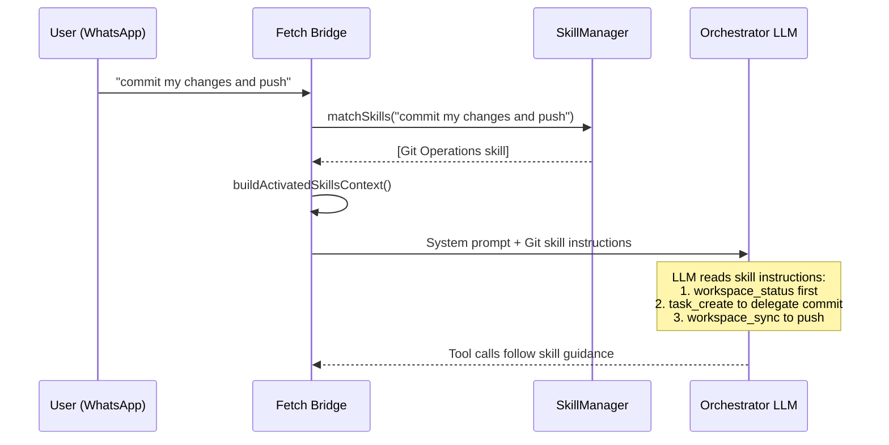

# Skills Guide

Skills are **hot-loadable instruction modules** that guide Fetch's tool usage for specific domains. When your message matches a skill's triggers, that skill's instructions are injected into the system prompt — teaching the orchestrator LLM how to use Fetch's 27 tools for that particular task type.

## How Skills Work



### Lifecycle

1. **Load** — On startup, `SkillManager.init()` loads built-in skills from `src/skills/builtin/` and user skills from `data/skills/`
2. **Match** — Every message runs through `matchSkills()` — case-insensitive substring matching against `triggers` arrays
3. **Inject** — Matched skills are wrapped in XML and added to the system prompt as `<activated_skill>` blocks
4. **Guide** — The LLM reads the instructions and follows them when making tool calls

Skills **don't execute anything directly**. They guide the orchestrator LLM's decision-making about which tools to call and which harness to delegate to.

---

## Built-in Skills (7)

Fetch ships with 7 built-in skills that cover common development workflows. Each one maps user intent to specific Fetch tools and harness routing.

| Skill | Triggers | Harness Hint | What It Guides |
|-------|----------|-------------|---------------|
| **Fetch Meta** | `what can you do`, `system status`, `capabilities` | — | Self-reporting via `workspace_list`, `workspace_status`, `task_status` |
| **Git Operations** | `git`, `commit`, `push`, `branch`, `merge`, `PR` | `copilot` | Git workflows via `workspace_status` → `task_create` → `workspace_sync` + all 8 GitHub tools |
| **Docker Management** | `docker`, `container`, `compose`, `kennel` | `claude` | Container orchestration via `task_create`, safety guards via `ask_user` |
| **TypeScript** | `typescript`, `tsconfig`, `type error`, `TS2345` | `claude` | Type fixes via `task_create` with coding standards baked into the goal |
| **React** | `react`, `component`, `hook`, `jsx`, `next.js` | `claude` | Component work via `workspace_status` → `task_create` with framework-aware goals |
| **Testing & QA** | `test`, `vitest`, `jest`, `e2e`, `coverage` | `claude` | Test creation/execution via `task_create`, bug-first-test-then-fix pattern |
| **Debugging** | `debug`, `error`, `broken`, `crash`, `bug` | `claude` | Structured diagnosis: `workspace_status` → `ask_user` → `task_create` with error context |

### Skill Anatomy

Each skill includes:

- **Instructions** — Step-by-step tool-call guidance per user scenario
- **Harness Routing** — Which CLI (Claude/Gemini/Copilot) to delegate to and why
- **Harness Hint** — Optional `harnessHint` in frontmatter that renders as an XML attribute, giving the LLM a skill-aware routing nudge
- **Tool Reference** — The exact Fetch tool names the LLM should use

Example from the Git skill:

```
When the user asks to commit or push:
1. Call `workspace_status` to verify there are uncommitted changes
2. Delegate to a harness via `task_create` with a clear goal
3. After the task completes, call `workspace_sync` to push
```

---

## Creating Custom Skills

Create a directory with a `SKILL.md` file in `data/skills/`:

```
data/skills/
└── my-skill/
    └── SKILL.md
```

### File Format

```markdown
---
name: Database Management
description: PostgreSQL workflow guidance for the Fetch orchestrator.
harnessHint: claude
triggers:
  - database
  - postgres
  - migration
  - schema
requirements:
  binaries:
    - psql
  envVars:
    - DATABASE_URL
  platform:
    - linux
enabled: true
---

# Database Management Skill

## Instructions

When the user asks to run a database migration:
1. Call `workspace_status` to confirm the active project
2. Use `ask_user` to confirm the migration is safe (especially in production)
3. Delegate via `task_create` to **Claude** with goal including the migration command

When the user asks to check database status:
1. Delegate via `task_create` with goal: "Run `psql $DATABASE_URL -c 'SELECT version()'`"

## Harness Routing

- Schema changes, migrations → **Claude** (needs careful reasoning)
- Quick queries, status checks → **Gemini** (fast execution)

## Tool Reference

- `workspace_status` — Check project state
- `task_create` — Delegate database commands
- `ask_user` — Confirm destructive operations
```

### Frontmatter Fields

| Field | Required | Type | Description |
|-------|----------|------|-------------|
| `name` | Yes | string | Display name |
| `description` | Yes | string | Short description (shown in skills summary) |
| `triggers` | No | string[] | Keywords that activate this skill |
| `harnessHint` | No | string | Suggested harness: `claude`, `gemini`, or `copilot` |
| `requirements.binaries` | No | string[] | Required CLI tools (not validated at load time) |
| `requirements.envVars` | No | string[] | Required environment variables (validated at load time) |
| `requirements.platform` | No | string[] | OS restrictions: `linux`, `darwin`, `win32` |
| `enabled` | No | boolean | Default: `true`. Set to `false` to disable |

---

## Best Practices

### 1. Reference Actual Tools

Skills should guide the LLM to use Fetch's tools — not describe how to run shell commands directly.

**Good:** "Use `workspace_status` to check the current branch, then `task_create` to delegate the commit."

**Bad:** "Run `git status` to check the branch, then `git commit -m '...'`."

### 2. Include Harness Routing

Tell the LLM which harness is best for different sub-tasks within the skill domain.

**Good:** "Complex merges → **Claude**. Simple commits → **Gemini**."

### 3. Specific Triggers

Choose triggers that match user intent without false positives.

**Good:** `database`, `postgres`, `migration`, `schema`

**Bad:** `code`, `help`, `fix` (too generic — will activate on everything)

### 4. Concise Instructions

Skills are injected into the system prompt, consuming context tokens. Be direct and rule-based.

**Good:** "Always call `workspace_status` before any git operation."

**Bad:** "It is generally considered a good practice to verify the current state of the repository before performing any operations..."

### 5. Add a Tool Reference Section

List the exact tool names relevant to this skill. This serves as a quick-reference for the LLM.

---

## Hot-Reload

You don't need to restart Fetch when adding or editing skills.

1. Create `data/skills/my-skill/SKILL.md`
2. Save the file
3. Send a message using one of the triggers

The `SkillManager` watches `data/skills/` via `chokidar` and reloads automatically.

### Lifecycle Management

The `SkillManager` now implements a `shutdown()` method for clean resource cleanup:

- Closes chokidar file watcher to release file system handles
- Removes all event listeners to prevent memory leaks
- Called automatically during Bridge shutdown sequence

### Error Handling

Watcher errors are logged but non-fatal. If the file watcher encounters an error:
- Error is logged with structured logging
- Hot-reload continues on subsequent file changes
- System remains operational

> [!NOTE]
> Hot-reload only applies to **user skills** in `data/skills/`. Built-in skills in `src/skills/builtin/` require a code rebuild to update.

---

## How Skills Appear in the Prompt

Skills are rendered in two sections of the system prompt:

### 1. Available Skills Summary (always present)

```xml
<available_skills>
  <skill id="git">
    <name>Git Operations</name>
    <description>Git workflow orchestration</description>
    <triggers>git, commit, push, branch, merge, rebase, PR</triggers>
  </skill>
  ...
</available_skills>
```

### 2. Activated Skill Instructions (only when matched)

```xml
<activated_skill name="Git Operations" harness_hint="copilot">
  <instructions>
    [Full markdown body of the skill]
  </instructions>
</activated_skill>
```

The `harness_hint` attribute (when present) gives the LLM a skill-aware nudge about which harness to delegate to. The LLM is instructed: "Follow activated skill instructions as expert procedural guidance."
