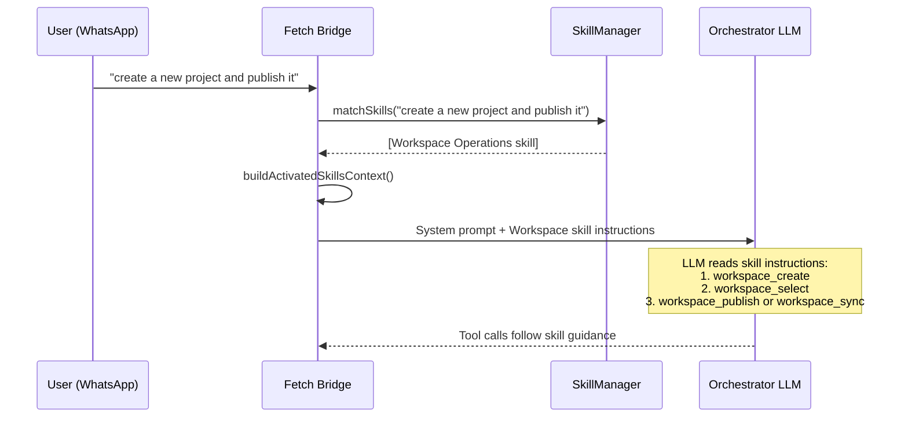

# Skills Guide

## Implementation References

- Skill lifecycle: `fetch-app/src/skills/index.ts`, `fetch-app/src/skills/loader.ts`, `fetch-app/src/skills/manager.ts`, `fetch-app/src/skills/types.ts`.
- Built-in skills: `fetch-app/src/skills/builtin/**/SKILL.md`.
- Tool contract source: `fetch-app/src/validation/tools.ts`, `fetch-app/src/tools/registry.ts`.
- User skill storage: `data/skills/`.
- Validation tests: `fetch-app/tests/unit/skills-manager.test.ts`, `fetch-app/tests/unit/tool-validation-contracts.test.ts`.


Skills are **hot-loadable instruction modules** that guide Fetch's tool usage for specific workflows. When your message matches a skill's triggers, that skill's instructions are injected into the system prompt to steer tool selection and call order.

## How Skills Work



### Lifecycle

1. **Load** — On startup, `SkillManager.init()` loads built-in skills from `src/skills/builtin/` and user skills from `data/skills/`
2. **Match** — Every message runs through `matchSkills()` — case-insensitive substring matching against `triggers` arrays
3. **Inject** — Matched skills are wrapped in XML and added to the system prompt as `<activated_skill>` blocks
4. **Guide** — The LLM reads the instructions and follows them when making tool calls

Skills **don't execute anything directly**. They guide the orchestrator LLM's decision-making about which tools to call and which harness to delegate to.

---

## Built-in Skills (Current Set)

Fetch ships with built-in skills under `fetch-app/src/skills/builtin/` aligned to the current tool categories.
Treat that folder as canonical for the live built-in set.

| Skill | Triggers | What It Guides |
|-------|----------|---------------|
| **Fetch Meta** | `what can you do`, `system status`, `capabilities` | Capability and runtime status reporting |
| **Workspace Operations** | `workspace`, `create project`, `publish project`, `delete file` | Workspace lifecycle, cleanup, sync, and publish |
| **Task Orchestration** | `implement`, `fix this`, `delegate`, `continue task` | Task create/status/respond/cancel flows |
| **GitHub Operations** | `pull request`, `issue`, `branch`, `actions` | PR, issue, branch, workflow, and repo search operations |
| **Web Research** | `docs`, `research`, `look up`, `search web` | `web_search` and `web_fetch` research workflows |
| **Browser Automation** | `open browser`, `fill form`, `screenshot page` | `browser_open`/`snapshot`/`action`/`screenshot` loops |
| **Interaction Control** | `clarify`, `confirm`, `status update`, `approval` | `ask_user` and `report_progress` usage patterns |

> [!TIP]
> Workflow and cron requests are usually handled by the general LLM tool loop (`workflow_*`, `cron_*`, `app_run`, `app_test`, `browser_test`) rather than a dedicated built-in workflow skill.

### Tool Usage Playbooks

Use these standard sequences when writing or reviewing skill instructions:

1. Workspace: `workspace_list` -> `workspace_select` -> `workspace_status` -> (`workspace_publish` or `workspace_sync`)
2. Task: `workspace_status` -> `task_create` -> `task_status` -> (`task_respond` or `task_cancel` as needed)
3. GitHub: `workspace_status` -> (`github_pr_*` / `github_issue_*` / `github_branch_create`) -> `github_action_status`
4. Web: `web_search` -> `web_fetch` -> summarize with links
5. Browser: `browser_open` -> `browser_snapshot` -> `browser_action` loop -> `browser_screenshot`
6. Interaction: `ask_user` for ambiguity/approval, `report_progress` for milestone updates

### Tool Alignment Rules

Use these rules to keep skills aligned with the live tool surface and avoid drift:

1. Treat `fetch-app/src/validation/tools.ts` as the canonical source for valid tool names and parameters.
2. Do not hardcode category counts in skill text; counts can change as tools are added.
3. Prefer tool names in backticks and verify each name exists before merging skill changes.
4. If tool behavior changes, update both the relevant `SKILL.md` and this guide in the same PR.
5. Keep skill instructions at the tool layer (tool names + call order), not low-level utility modules such as `utils/*` or `transcription/*`.
6. Treat `workspace/*` internals (`manager`, `profiler`, `repo-map`, `symbols`) as implementation details; skills should reference `workspace_*` tools instead.

### Canonical Files For Skill Maintenance

When updating skills, always verify against:

- `fetch-app/src/skills/builtin/**/SKILL.md` (built-in skill content)
- `fetch-app/src/skills/manager.ts` (matching + injection behavior)
- `fetch-app/src/skills/loader.ts` (frontmatter validation + requirements handling)
- `fetch-app/src/validation/tools.ts` (valid tool names and parameters)
- `fetch-app/src/tools/registry.ts` (registered handlers and danger policy)

### Skill-to-Tool Module Map

Use this map to keep skill instructions tied to concrete handlers.

| Skill | Primary Tool Family | Source Module |
|-------|----------------------|---------------|
| Workspace Operations | `workspace_*`, `file_delete`, `folder_delete` | `fetch-app/src/tools/workspace.ts` |
| Task Orchestration | `task_*` | `fetch-app/src/tools/task.ts` |
| Interaction Control | `ask_user`, `report_progress` | `fetch-app/src/tools/interaction.ts` |
| GitHub Operations | `github_*` | `fetch-app/src/tools/github.ts` |
| Web Research | `web_fetch`, `web_search` | `fetch-app/src/tools/web.ts` |
| Browser Automation | `browser_*` | `fetch-app/src/tools/browser.ts` |
| Fetch Meta | Status/capability queries (prompt guidance, minimal direct tool usage) | `fetch-app/src/agent/prompts.ts` and `fetch-app/src/agent/core.ts` |

### Skill Anatomy

Each skill includes:

- **Instructions** — Step-by-step tool-call guidance per user scenario
- **Tool Sequence** — Recommended order of tool calls for common workflows
- **Tool Reference** — The exact Fetch tool names the LLM should use

Example from the Workspace Operations skill:

```
When the user asks to publish a new project:
1. Call `workspace_create` with `name` and `template`
2. Call `workspace_select` for that workspace
3. Call `workspace_publish` if remote is missing, otherwise `workspace_sync`
```

---

## Creating Custom Skills

Create a directory with a `SKILL.md` file in `data/skills/`:

```
data/skills/
└── my-skill/
    └── SKILL.md
```

### File Format

```markdown
---
name: Database Management
description: PostgreSQL workflow guidance for the Fetch orchestrator.
triggers:
  - database
  - postgres
  - migration
  - schema
requirements:
  binaries:
    - psql
  envVars:
    - DATABASE_URL
  platform:
    - linux
enabled: true
---

# Database Management Skill

## Instructions

When the user asks to run a database migration:
1. Call `workspace_status` to confirm the active project
2. Use `ask_user` to confirm the migration is safe (especially in production)
3. Delegate via `task_create` to **Claude** with goal including the migration command

When the user asks to check database status:
1. Delegate via `task_create` with goal: "Run `psql $DATABASE_URL -c 'SELECT version()'`"

## Harness Routing

- Schema changes, migrations → **Claude** (needs careful reasoning)
- Quick queries, status checks → **Gemini** (fast execution)

## Tool Reference

- `workspace_status` — Check project state
- `task_create` — Delegate database commands
- `ask_user` — Confirm destructive operations
```

### Frontmatter Fields

| Field | Required | Type | Description |
|-------|----------|------|-------------|
| `name` | Yes | string | Display name |
| `description` | Yes | string | Short description (shown in skills summary) |
| `triggers` | No | string[] | Keywords that activate this skill |
| `requirements.binaries` | No | string[] | Required CLI tools (not validated at load time) |
| `requirements.envVars` | No | string[] | Required environment variables (validated at load time) |
| `requirements.platform` | No | string[] | OS restrictions: `linux`, `darwin`, `win32` |
| `enabled` | No | boolean | Default: `true`. Set to `false` to disable |

---

## Best Practices

### 1. Reference Actual Tools

Skills should guide the LLM to use Fetch's tools — not describe how to run shell commands directly.

**Good:** "Use `workspace_status` to check the current branch, then `task_create` to delegate the commit."

**Bad:** "Run `git status` to check the branch, then `git commit -m '...'`."

### 2. Define Tool Sequence

Tell the LLM which tools to call first, next, and last for a workflow.

**Good:** "`workspace_status` before `workspace_sync` for any publish/sync request."

### 3. Specific Triggers

Choose triggers that match user intent without false positives.

**Good:** `database`, `postgres`, `migration`, `schema`

**Bad:** `code`, `help`, `fix` (too generic — will activate on everything)

### 4. Concise Instructions

Skills are injected into the system prompt, consuming context tokens. Be direct and rule-based.

**Good:** "Always call `workspace_status` before any git operation."

**Bad:** "It is generally considered a good practice to verify the current state of the repository before performing any operations..."

### 5. Add a Tool Reference Section

List the exact tool names relevant to this skill. This serves as a quick-reference for the LLM.

---

## Hot-Reload

You don't need to restart Fetch when adding or editing skills.

1. Create `data/skills/my-skill/SKILL.md`
2. Save the file
3. Send a message using one of the triggers

The `SkillManager` watches `data/skills/` via `chokidar` and reloads automatically.

### Lifecycle Management

The `SkillManager` now implements a `shutdown()` method for clean resource cleanup:

- Closes chokidar file watcher to release file system handles
- Removes all event listeners to prevent memory leaks
- Called automatically during Bridge shutdown sequence

### Error Handling

Watcher errors are logged but non-fatal. If the file watcher encounters an error:
- Error is logged with structured logging
- Hot-reload continues on subsequent file changes
- System remains operational

> [!NOTE]
> Hot-reload only applies to **user skills** in `data/skills/`. Built-in skills in `src/skills/builtin/` require a code rebuild to update.

---

## How Skills Appear in the Prompt

Skills are rendered in two sections of the system prompt:

### 1. Available Skills Summary (always present)

```xml
<available_skills>
  <skill id="workspace-operations">
    <name>Workspace Operations</name>
    <description>Workspace lifecycle, cleanup, and sync workflows</description>
    <triggers>workspace, create project, publish project, delete file</triggers>
  </skill>
  ...
</available_skills>
```

### 2. Activated Skill Instructions (only when matched)

```xml
<activated_skill name="Workspace Operations">
  <instructions>
    [Full markdown body of the skill]
  </instructions>
</activated_skill>
```

The LLM is instructed to follow activated skill instructions as procedural guidance for tool selection and call order.
