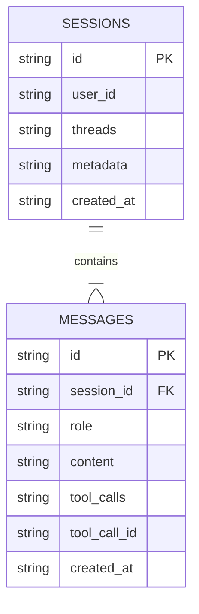
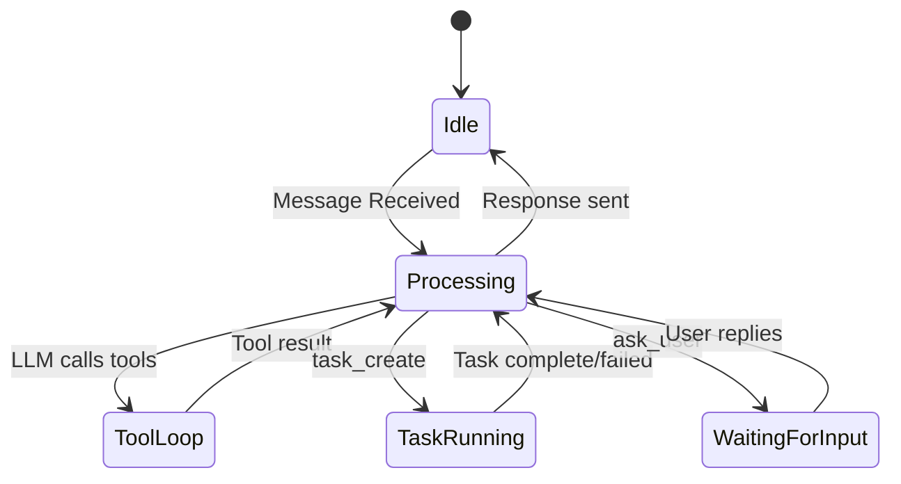

# State Management

> Fetch persists state across three layers: **Session** (Message History), **Workspace** (Git/File Context), and **Task** (Active Jobs). All state is backed by SQLite (WAL mode) for crash-safety and zero-config deployment.



## Session Architecture

The `SessionManager` orchestrates all state changes. It wraps SQLite transactions to ensure that message history, tool outputs, and metadata updates are atomic.

### Schema (Simplified)

```sql
CREATE TABLE sessions (
  id TEXT PRIMARY KEY,
  user_id TEXT NOT NULL,
  threads TEXT, -- JSON array of thread IDs
  metadata TEXT, -- JSON: complexity, projectType, autonomyLevel
  created_at DATETIME DEFAULT CURRENT_TIMESTAMP
);

CREATE TABLE messages (
  id TEXT PRIMARY KEY,
  session_id TEXT NOT NULL,
  role TEXT NOT NULL, -- user, assistant, tool
  content TEXT NOT NULL,
  tool_calls TEXT, -- JSON: [{id, function: {name, arguments}}]
  tool_call_id TEXT, -- For role='tool'
  created_at DATETIME DEFAULT CURRENT_TIMESTAMP
);
```

### Message Flow



The system follows a request-response cycle managed by the agent core:

1. **Idle**: Waiting for a WhatsApp message.
2. **Processing**: Security gate passed, LLM reasoning with tools available.
3. **ToolLoop**: LLM is calling tools (up to 5 rounds per message).
4. **TaskRunning**: A harness task is executing in the Kennel container.
5. **WaitingForInput**: The `ask_user` tool has paused execution pending user reply.

## Workspace State

Fetch is "stateless" regarding file edits — it reads the current state of the disk and git index on every turn. This prevents "Context Amnesia" where the agent thinks a file exists but it was deleted externally.

Each tool call (`workspace_select`, `git_commit`) triggers a re-read of the repo map, ensuring the LLM always sees the ground truth.
