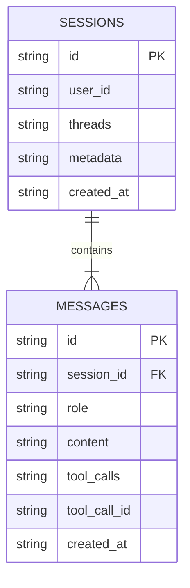
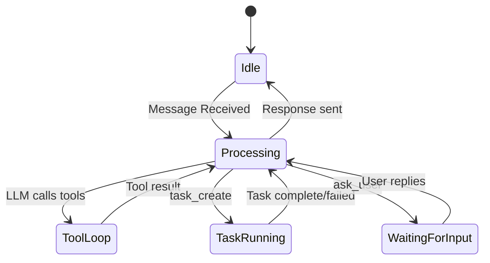

# State Management

> Fetch persists state across three layers: **Session** (Message History), **Workspace** (Git/File Context), and **Task** (Active Jobs). All state is backed by SQLite (WAL mode) for crash-safety and zero-config deployment.



## Session Architecture

The session subsystem has two layers:

- `SessionStore` (`src/session/store.ts`) handles SQLite schema, prepared statements, and persistence.
- `SessionManager` (`src/session/manager.ts`) orchestrates message operations, compaction, repo-map cache checks, and memory recall helpers.

## Task Architecture

The task subsystem also uses manager + store layering:

- `TaskStore` (`src/task/store.ts`) persists task rows and current active task id in SQLite.
- `TaskManager` (`src/task/manager.ts`) enforces task lifecycle transitions and emits task events.
- `TaskIntegration` (`src/task/integration.ts`) bridges harness executor events into task manager updates and task-scoped notifications.

## Source Responsibility Index

| File | Purpose |
|------|---------|
| `src/session/types.ts` | Session/message/memory type contracts and factories (`createSession`, `createMessage`) |
| `src/session/store.ts` | SQLite persistence for sessions + memory entries (CRUD, cleanup, pagination, recall) |
| `src/session/manager.ts` | High-level API used by handlers/tools (message append, compaction, repo-map staleness, memory delegation) |
| `src/task/types.ts` | Task domain contracts (status model, constraints, progress/result/event payloads) |
| `src/task/store.ts` | SQLite persistence for tasks and active task pointer |
| `src/task/manager.ts` | Task lifecycle state transitions, agent selection, event emission |
| `src/task/integration.ts` | Task execution bridge between task manager and harness executor events |

### Concurrency Control

Session persistence relies on SQLite WAL mode with synchronous `better-sqlite3` statements scoped behind `SessionStore`.
`SessionManager` centralizes write paths (`addUserMessage`, `addAssistantMessage`, `addToolMessage`, `updateSession`) so session mutations use one persistence boundary.
Background compaction runs as a follow-up task and writes results through the same store API.

### Schema (Simplified)

```sql
CREATE TABLE sessions (
  id TEXT PRIMARY KEY,
  user_id TEXT UNIQUE NOT NULL,
  data TEXT NOT NULL, -- serialized Session JSON blob
  created_at TEXT NOT NULL,
  last_activity_at TEXT NOT NULL
);

CREATE TABLE memory (
  id TEXT PRIMARY KEY,
  session_id TEXT NOT NULL,
  category TEXT NOT NULL,
  content TEXT NOT NULL,
  keywords TEXT NOT NULL,
  importance INTEGER DEFAULT 1,
  created_at TEXT NOT NULL
);
```

### Message Flow



The system follows a request-response cycle managed by the agent core:

1. **Idle**: Waiting for a WhatsApp message.
2. **Processing**: Security gate passed, LLM reasoning with tools available.
3. **ToolLoop**: LLM is calling tools (up to 5 rounds per message).
4. **TaskRunning**: A harness task is executing in the Kennel container.
5. **WaitingForInput**: The `ask_user` tool has paused execution pending user reply.

## Session Operations

### Atomic Session Clear

The store `clear(sessionId)` path resets the session to a new baseline while preserving stable fields (`id`, `createdAt`, `preferences`):

1. Read current session
2. Build new baseline via `createSession(userId)`
3. Restore stable fields
4. Persist through store update

### Compaction Failure Tracking

Compaction failures are tracked with escalating behavior:

1. **First failure**: Log warning, continue normal operation
2. **Second failure**: Log error with stack trace
3. **Third+ failures**: Disable compaction for this session, log critical warning

This prevents infinite retry loops while preserving system stability. The failure counter resets on successful compaction.

Session compaction only touches session history and metadata. Memory entries for previous summaries are inserted through `SessionStore.addMemory()` before overwriting compaction summary content.

## Workspace State

Fetch is "stateless" regarding file edits — it reads the current state of the disk and git index on every turn. This prevents "Context Amnesia" where the agent thinks a file exists but it was deleted externally.

Each tool call (`workspace_select`, `workspace_create`, `task_create`) triggers a re-read of the repo map, ensuring the LLM always sees the ground truth.
