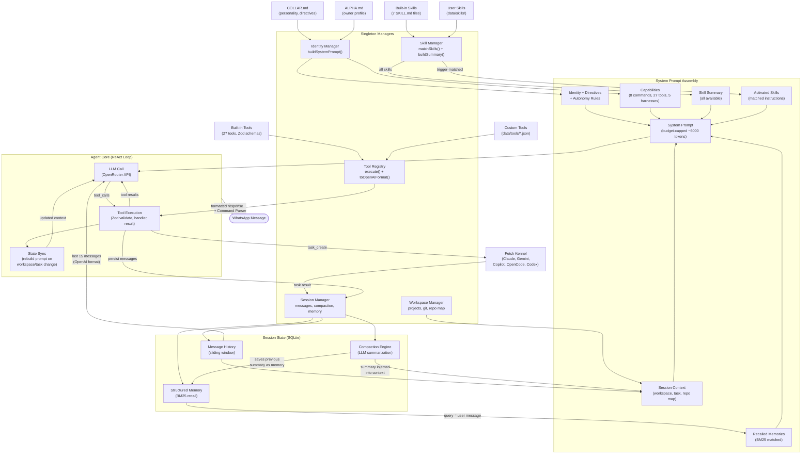

# Systems Deep Dive

Every WhatsApp message follows **one path** through these systems. There's no router or classifier - the LLM sees everything and decides what to do.

```text
Message arrives
  → Security Gate (whitelist + rate limit)
  → Command Parser (8 slash commands bypass LLM)
  → Agent Core (everything else)
    → Assembles context from ALL systems below
    → LLM decides: chat, call tools, or delegate to harness
    → Tool loop (up to 5 rounds)
    → Response sent back via WhatsApp
```

---

## 1. Identity (Who Fetch Is)

**Files**: `identity/manager.ts`, `identity/loader.ts`, `identity/types.ts`
**Data**: `data/identity/COLLAR.md` + `data/identity/ALPHA.md`

Identity defines Fetch's persona - name, role, voice tone, emoji, and three tiers of directives (primary/secondary/behavioral). It's loaded from markdown files at startup and hot-reloaded via chokidar when files change.

`IdentityManager` is a singleton that owns the system prompt. Its `buildSystemPrompt()` method is the **single assembly point** where everything comes together:

```text
System Prompt = Identity + Directives + Autonomy Rules + Capabilities
              + Session Context (workspace, task, repo map, memories)
              + Skills (summary + activated instructions)
```

The whole prompt is budget-capped at ~6000 tokens (`FETCH_CONTEXT_BUDGET`). If it exceeds that, session context is truncated first, then skill instructions.

---

## 2. Sessions (Conversation State)

**Files**: `session/manager.ts`, `session/store.ts`, `session/types.ts`

A session is the **full state** for one WhatsApp user. It persists to SQLite as a JSON blob:

```typescript
Session {
  id, userId,
  messages: Message[],           // Full conversation history
  currentProject,                // Active workspace (name, path, git branch, profile)
  activeTaskId,                  // Currently running task
  repoMap,                       // File tree structure
  preferences,                   // autonomyLevel, autoCommit, etc.
  metadata: {
    compactionSummary,           // Summarized old messages
    activeThreadId,              // Named conversation branch
  }
}
```

**Message types**: `user`, `assistant`, `tool`. Assistant messages can carry `toolCalls` (requests), tool messages carry `toolCall` (result). They're paired by `tool_call_id` for OpenAI's multi-turn format.

**Message lifecycle**:

1. User message arrives → `addUserMessage()` → pushed to `session.messages` → saved to SQLite
2. LLM responds with tool calls → `addAssistantToolCallMessage()` → persisted **before** execution
3. Tool executes → `addToolMessage()` → result persisted with matching `tool_call_id`
4. LLM responds with text → `addAssistantMessage()` → final response

---

## 3. Compaction (Memory Management)

When `session.messages` exceeds the compaction threshold (default 50), old messages get summarized:

1. Take all messages except the last 15 (the `historyWindow`)
2. Save the **previous** compaction summary as a memory entry (category: `compaction_summary`, importance: 2)
3. Send old messages to a cheap LLM (`gpt-4o-mini`) for summarization (~300 tokens)
4. Store new summary in `session.metadata.compactionSummary`
5. Trim `session.messages` to last 15

This creates a **chained summarization** pattern - each compaction preserves the previous summary as a memory, so context is never truly lost. It just gets progressively more condensed.

---

## 4. Memory & BM25 Recall (Cross-Session Knowledge)

**Storage**: `memory` table in `sessions.db` with category, content, keywords, importance (1-5), recall tracking.

Currently only compaction produces memories, but the schema supports `fact`, `preference`, `decision`, `file_operation` for future use.

**Recall algorithm** (`session/store.ts`):

1. Fetch top 15 candidates ordered by importance + recency
2. Parse user message into terms (lowercase, drop terms shorter than 3 chars)
3. Score each candidate: `(keyword_hits x 3 + content_hits x 1) x (1 + importance x 0.2)`
4. Sort by score, filter zeros, return top 5
5. Update `last_recalled_at` and `recall_count` on returned memories

**Injection**: Recalled memories appear in the system prompt as:

```text
## Recalled Context
- [compaction_summary] Previous work included refactoring auth module...
- [fact] Project uses React 18 with TypeScript
```

### Scoring breakdown

| Importance | Multiplier | Example score (2 keyword hits, 1 content hit) |
| --- | --- | --- |
| 1 | 1.2x | (6 + 1) x 1.2 = **8.4** |
| 2 | 1.4x | (6 + 1) x 1.4 = **9.8** |
| 3 | 1.6x | (6 + 1) x 1.6 = **11.2** |
| 4 | 1.8x | (6 + 1) x 1.8 = **12.6** |
| 5 | 2.0x | (6 + 1) x 2.0 = **14.0** |

---

## 5. Skills (Domain Expertise)

**Files**: `skills/manager.ts`, `skills/loader.ts`, `skills/types.ts`
**Data**: `src/skills/builtin/` (7 built-in) + `data/skills/` (user-defined, hot-reloaded)

Each skill is a `SKILL.md` with YAML frontmatter:

```yaml
---
name: Git Operations
triggers: [git, commit, push, branch]
harnessHint: copilot
enabled: true
---
# Instructions
When the user asks to commit...
```

### Two-phase injection

1. **Discovery** - `buildSkillsSummary()` lists ALL skills in `<available_skills>` XML so the LLM knows what exists
2. **Activation** - `matchSkills(message)` checks if any trigger keywords appear in the user's message. Matched skills get their **full instruction body** injected as `<activated_skill>` into the prompt

**Example**: user says "commit these changes" → `commit` matches the git skill → full git workflow instructions appear in the prompt → LLM follows them.

Skills also carry a `harnessHint` (e.g. `"copilot"`) that suggests which AI agent to delegate to when the skill is activated.

### Built-in skills

| Skill | Triggers | Harness Hint |
| --- | --- | --- |
| Git Operations | git, commit, push, branch | copilot |
| Docker | docker, container, compose | copilot |
| Testing | test, jest, vitest, coverage | claude |
| TypeScript | typescript, ts, type, interface | claude |
| React | react, component, jsx, hook | claude |
| Debugging | debug, error, bug, fix | claude |
| Fetch Meta | fetch, self, meta, update | claude |

---

## 6. Tools (What Fetch Can Do)

**Files**: `tools/registry.ts`, `tools/types.ts`, `tools/*.ts`

27 built-in tools across 6 categories:

| Category | Count | Examples |
| --- | --- | --- |
| Workspace | 7 | list, select, status, create, delete, sync, publish |
| Task | 4 | create, status, cancel, respond |
| Interaction | 2 | ask_user, report_progress |
| GitHub | 8 | pr_create, pr_list, issue_create, branch_create... |
| Web | 2 | web_fetch, web_search |
| Browser | 4 | browser_open, snapshot, action, screenshot |

Every tool has:

- **Zod schema** for input validation (LLM gets error messages to self-correct)
- **Handler function** that receives validated args + `ToolContext { sessionId, autonomyLevel }`
- **DangerLevel** (`SAFE`, `MODERATE`, `DANGEROUS`)
- Returns `ToolResult { success, output, summary, error, duration, metadata }`

**Custom tools** are JSON files in `data/tools/` that wrap shell commands with `{{param}}` placeholders. Parameters are shell-escaped to prevent injection. Hot-reloaded via chokidar.

The registry exports all tools in OpenAI function-calling format via `toOpenAIFormat()`. The LLM sees every tool on every message and decides which (if any) to call.

### Tool execution flow

```text
LLM outputs tool_call
  → Parse arguments (JSON)
  → Validate with Zod schema
    → If invalid: return error, LLM self-corrects on next round
    → If valid: continue
  → Execute handler with ToolContext { sessionId, autonomyLevel }
  → Return ToolResult to LLM
  → LLM sees result, decides next action
```

---

## 7. Context Pipeline (The System Prompt)

`buildContextSection()` (`agent/prompts.ts`) assembles session-aware context:

1. **Thread metadata** (if named thread)
2. **Active workspace** (name, path, type, framework, git branch, commands) + `YOU ARE INSIDE THIS WORKSPACE` directive
3. **Active task** (goal preview + status)
4. **Compaction summary** (condensed older conversation)
5. **Repository map** (file tree structure, 5-min TTL)
6. **Recalled memories** (BM25 match against user message)
7. **Conversation count**

This context section gets passed to `IdentityManager.buildSystemPrompt()` which combines it with identity, directives, capabilities, and skills into the final `messages[0]` system prompt.

### Budget enforcement

The system prompt is capped at ~6000 tokens (`FETCH_CONTEXT_BUDGET`, estimated via chars/4). When the budget is exceeded:

1. **Session context is truncated first** (contains repo map, the largest variable section)
2. **Activated skill instructions are truncated second**
3. **Identity and capabilities are never truncated** (they're the core)

---

## 8. The Agent Core Loop (ReAct Pattern)

`agent/core.ts` - the heart of everything:

```text
processMessage(message, session)
  |
  +-- Check circuit breaker (consecutive error tracking per session)
  +-- Refresh repo map if stale (>5 min)
  |
  '-- handleWithTools(message, session)
      |
      +-- ASSEMBLE CONTEXT
      |   +-- SkillManager.matchSkills(message) --> matched skills
      |   +-- SkillManager.buildActivatedSkillsContext(matched) --> skill instructions
      |   +-- buildContextSection(session, message) --> workspace + task + memories
      |   +-- IdentityManager.buildSystemPrompt(skills, context) --> system prompt
      |   '-- buildMessageHistory(session) --> last 15 messages in OpenAI format
      |
      +-- INITIAL LLM CALL
      |   '-- openai.chat.completions.create({
      |        messages: [system, ...history, user],
      |        tools: registry.toOpenAIFormat(),  // all 27 tools
      |        tool_choice: 'auto'
      |      })
      |
      '-- TOOL LOOP (up to 5 rounds)
          |
          +-- For each tool_call in response:
          |   +-- Parse & validate arguments (Zod)
          |   +-- Persist tool request to session (BEFORE execution)
          |   +-- Execute: registry.execute(name, args, { sessionId, autonomyLevel })
          |   +-- Persist result to session (truncated if >4KB)
          |   '-- STATE SYNC: if workspace_select/task_create -->
          |      rebuild system prompt so LLM sees new context immediately
          |
          +-- Call LLM again with accumulated tool results
          '-- Repeat until no more tool_calls or 5 rounds hit
```

### Key design decisions

- **Tool requests persisted before execution** (crash safety)
- **Results truncated** to `toolResultMaxPersist` chars for session storage (full output available in current turn)
- **System prompt rebuilt mid-loop** after state-changing tools so the LLM immediately sees updated workspace/task context
- **On retry** (API error), history trimmed to last 4 messages to reduce payload size
- **Circuit breaker** tracks consecutive errors per session, triggers backoff after threshold

---

## 9. Systems Integration



### The critical insight

There is **no routing**. The LLM sees the complete system prompt (identity + context + skills + all 27 tools) on every single message and makes its own decisions. Skills guide it, tools empower it, context informs it, but nothing pre-classifies or restricts what it can do.

---

## Pipeline Configuration Reference

All parameters are tunable via `config/pipeline.ts` (42 settings, overridable via `FETCH_*` env vars).

### Context & History

| Parameter | Default | Env Var | Description |
| --- | --- | --- | --- |
| `contextBudget` | 6000 | `FETCH_CONTEXT_BUDGET` | Token budget for system prompt |
| `historyWindow` | 15 | `FETCH_HISTORY_WINDOW` | Messages kept in sliding window |
| `compactionThreshold` | 50 | `FETCH_COMPACTION_THRESHOLD` | Compact when messages exceed this |
| `compactionMaxTokens` | 300 | `FETCH_COMPACTION_MAX_TOKENS` | Max tokens for compaction summaries |

### Memory & Recall

| Parameter | Default | Env Var | Description |
| --- | --- | --- | --- |
| `recallLimit` | 5 | `FETCH_RECALL_LIMIT` | Max recalled memory entries |
| `recallSnippetTokens` | 300 | `FETCH_RECALL_SNIPPET_TOKENS` | Max tokens per snippet (unused) |
| `recallDecay` | 0.1 | `FETCH_RECALL_DECAY` | Recency decay factor (unused) |

### Tool Execution

| Parameter | Default | Env Var | Description |
| --- | --- | --- | --- |
| `maxToolCalls` | 5 | `FETCH_MAX_TOOL_CALLS` | Max tool call rounds per message |
| `toolMaxTokens` | 2048 | `FETCH_TOOL_MAX_TOKENS` | Token budget for LLM responses |
| `toolTemperature` | 0.3 | `FETCH_TOOL_TEMPERATURE` | Temperature for LLM responses |
| `toolResultMaxPersist` | 2000 | `FETCH_TOOL_RESULT_MAX_PERSIST` | Max chars for persisted tool results |
