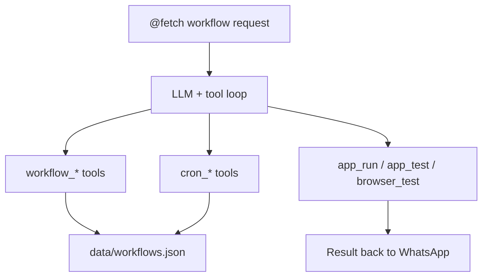

# Workflow Automation

## Implementation References

- Workflow runtime: `fetch-app/src/tools/workflow.ts`, `fetch-app/src/workflow/manager.ts`, `fetch-app/src/workflow/types.ts`.
- Persistence: `data/workflows.json`.
- Validation tests: `fetch-app/tests/unit/workflow-tools.test.ts`, `fetch-app/tests/unit/workflow-manager.test.ts`.


This guide explains exactly how users trigger and manage **workflows, cron jobs, and deterministic runtime checks** from WhatsApp.



## Quick Mental Model

1. User sends a natural-language message in WhatsApp (`@fetch ...` in group chats).
2. Fetch routes it through the normal LLM + tool loop.
3. The LLM chooses workflow/runtime tools (`workflow_*`, `cron_*`, `app_run`, `app_test`, `browser_test`) when relevant.
4. Fetch executes tools inside Kennel/workspace and replies with concise status/results.

No special slash commands are required for workflows and cron.

## Layer Boundaries

- `Delegation`: `task_create` for open-ended implementation and reasoning-heavy work.
- `Interactive`: `web_*` and browser session tools for exploration/inspection.
- `Execution`: `app_run`, `app_test`, `browser_test` for deterministic pass/fail steps.

Workflows should be composed mostly from `Execution` tools. If the step needs subjective reasoning, keep it outside workflows and use delegation.

## Core User Flows

### 1) Create a Reusable Workflow

User asks in WhatsApp:

```text
@fetch create a workflow called nightly-api-check for my active workspace:
1) show workspace status
2) run npm test
3) sync to github
```

Fetch does:

- Creates workflow via `workflow_create`
- Stores it in persistent workflow state (`data/workflows.json`)
- Returns confirmation with step count

Validation rules:

- Every step tool must exist in the registry at create time.
- Step tools cannot be orchestration-recursive (`workflow_create`, `workflow_run`, `workflow_delete`, `cron_create`, `cron_run`, `cron_delete`).
- Step tools cannot be task-interaction-only (`ask_user`, `report_progress`).

Typical response:

```text
Workflow "nightly-api-check" created with 3 step(s).
```

### 2) Run a Workflow Manually

User:

```text
@fetch run workflow nightly-api-check now
```

Fetch does:

- Calls `workflow_run`
- Optionally auto-selects workflow workspace first
- Executes each step in order
- Stops on first failed step
- Returns step-level summary

Typical response:

```text
nightly-api-check (...) completed with 3 steps
status:ok(...) | test:ok(app_test exit=0) | sync:ok(...)
```

### 3) Schedule a Workflow (Cron)

User:

```text
@fetch schedule nightly-api-check at 0 3 * * *
```

Fetch does:

- Calls `cron_create` with UTC cron expression
- Attaches cron job to the workflow
- Cron scheduler loop checks every ~15 seconds

Important:

- Cron uses **UTC**, not local timezone
- Format: `minute hour day month weekday`

### 4) Verify Cron Job Immediately

User:

```text
@fetch run cron job nightly-api-check now
```

Fetch does:

- Calls `cron_run`
- Triggers workflow immediately (same behavior as scheduled run)

### 5) Runtime Checks from WhatsApp

#### `app_run`

User:

```text
@fetch run this in my workspace: npm run build
```

Fetch:

- Calls `app_run`
- Executes shell command in workspace within Kennel
- Returns command output + exit code summary

#### `app_test`

User:

```text
@fetch run tests for this app
```

Fetch:

- Calls `app_test`
- Uses explicit command if provided, else auto-detects common test command
- Returns pass/fail and output summary

#### `browser_test`

User:

```text
@fetch browser test https://example.com and confirm it contains "Login"
```

Fetch:

- Opens URL in browser toolchain
- Captures accessibility snapshot
- Asserts required `mustInclude` substrings
- Optionally captures screenshot metadata
- Returns explicit pass/fail semantics for workflow-safe automation

## Day-to-Day Management

### List workflows and recent runs

```text
@fetch list workflows and recent runs
```

### List cron jobs

```text
@fetch show my cron jobs
```

### Delete a workflow

```text
@fetch delete workflow nightly-api-check
```

### Delete a cron job

```text
@fetch remove cron nightly-api-check
```

## Failure Behavior

- If a workflow step fails, run status is `failed` and remaining steps are not executed.
- If the same workflow is already running, new runs fail fast with an `already running` error.
- `app_run` / `app_test` propagate command exit codes and stderr/stdout.
- `browser_test` fails when required assertions are missing, making it safe for CI-like gates.
- Cron jobs keep `lastError` and update next-run timestamps.
- `/stop` and `task_cancel` terminate active harness processes when present, then mark task state cancelled.

## Operator Notes

- Workflow/cron state persists in `data/workflows.json`.
- State writes use temp-file + atomic rename semantics.
- Scheduler starts with bridge startup and shuts down cleanly with bridge teardown.
- On startup, scheduler computes missing `nextRunAt` values and catches up overdue cron jobs once.
- Workflow tools are part of the same registered orchestrator toolset; no separate routing mode is required.
